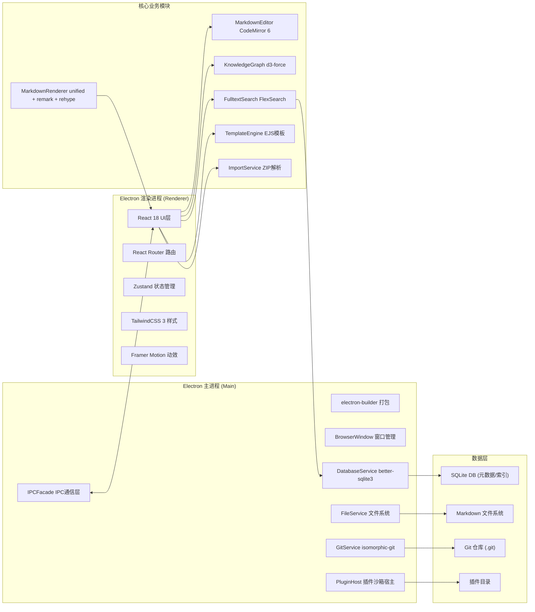

## 1. 架构设计



## 2. 技术栈描述

### 2.1 核心框架
- **桌面壳**：Electron 28 + electron-builder 24
- **前端渲染**：React 18 + TypeScript 5.3
- **构建工具**：Vite 5.0 + electron-vite 2.0
- **状态管理**：Zustand 4.5（轻量、无样板代码）
- **路由**：React Router Dom 6.20
- **样式**：TailwindCSS 3.4 + PostCSS
- **动效**：Framer Motion 10.16

### 2.2 编辑器与渲染
- **编辑器内核**：CodeMirror 6 + @codemirror/lang-markdown
- **Markdown渲染**：unified 11 + remark-parse 11 + remark-gfm + rehype-stringify 10
- **数学公式**：KaTeX 0.16 + remark-math
- **流程图**：Mermaid 10.6
- **代码高亮**：Shiki 0.14（VS Code同款高亮引擎）
- **双向链接解析**：自定义remark插件解析 `[[wiki-link]]` 语法

### 2.3 知识图谱
- **力导向图**：d3 7.8 + d3-force 3.0
- **PNG导出**：html2canvas 1.4 + 原生Canvas API

### 2.4 全文搜索
- **搜索引擎**：FlexSearch 0.7.31（中英文混合性能优于lunr.js）
- **中文分词**：nodejieba 2.6（原生Node.js模块，主进程运行）
- **索引存储**：better-sqlite3 9.2 BLOB字段持久化

### 2.5 版本控制
- **Git操作**：isomorphic-git 1.27（纯JS实现，无需系统Git）
- **HTTP/SSH传输**：@isomorphic-git/http 2.0 + @isomorphic-git/ssh 1.0
- **Diff计算**：diff 5.1
- **冲突合并**：merge 2.1

### 2.6 数据存储
- **元数据**：better-sqlite3 9.2（文档路径、标签、反向链接、索引）
- **文件存储**：直接读写文件系统，用户Markdown文件保持原生格式
- **配置存储**：electron-store 8.1

### 2.7 插件系统
- **沙箱隔离**：iframe + postMessage + 自定义RPC协议
- **扩展点**：编辑器组件、侧边栏面板、导入过滤器、导出格式、AI服务
- **插件加载**：动态import() + 安全白名单
- **插件市场**：npm registry 兼容

### 2.8 导入导出
- **ZIP解析**：JSZip 3.10
- **Notion解析**：自定义解析器处理Notion Markdown变体
- **语雀解析**：自定义解析器处理语雀Markdown导出格式

## 3. 目录结构

```
DF1-32/
├── package.json
├── tsconfig.json
├── vite.config.ts
├── electron-builder.yml
├── src/
│   ├── main/                 # Electron主进程
│   │   ├── index.ts          # 主进程入口
│   │   ├── ipc/              # IPC通信层
│   │   │   ├── index.ts
│   │   │   ├── file.ts       # 文件操作通道
│   │   │   ├── git.ts        # Git操作通道
│   │   │   ├── db.ts         # 数据库操作通道
│   │   │   └── plugin.ts     # 插件操作通道
│   │   ├── services/         # 主进程服务
│   │   │   ├── FileService.ts
│   │   │   ├── GitService.ts
│   │   │   ├── DatabaseService.ts
│   │   │   ├── SearchService.ts
│   │   │   └── PluginHost.ts
│   │   └── preload.ts        # 预加载脚本
│   │
│   ├── renderer/             # Electron渲染进程
│   │   ├── main.tsx          # React入口
│   │   ├── App.tsx           # 根组件
│   │   ├── router.tsx        # 路由配置
│   │   ├── store/            # Zustand状态
│   │   │   ├── useAppStore.ts
│   │   │   ├── useEditorStore.ts
│   │   │   └── useGitStore.ts
│   │   ├── components/       # 通用组件
│   │   │   ├── Layout/
│   │   │   ├── Sidebar/
│   │   │   ├── Toolbar/
│   │   │   └── Modal/
│   │   ├── pages/            # 页面组件
│   │   │   ├── Dashboard/
│   │   │   ├── Editor/
│   │   │   ├── Graph/
│   │   │   ├── Search/
│   │   │   ├── Git/
│   │   │   ├── Templates/
│   │   │   ├── Import/
│   │   │   ├── Plugins/
│   │   │   └── Settings/
│   │   ├── hooks/            # 自定义Hooks
│   │   │   ├── useIPC.ts
│   │   │   ├── useDebounce.ts
│   │   │   └── useThrottle.ts
│   │   └── styles/           # 全局样式
│   │       ├── index.css
│   │       ├── editor.css
│   │       ├── markdown.css
│   │       └── themes/       # 编辑器主题
│   │
│   ├── shared/               # 主进程/渲染进程共享
│   │   ├── types/            # TypeScript类型定义
│   │   │   ├── document.ts
│   │   │   ├── git.ts
│   │   │   ├── plugin.ts
│   │   │   └── index.ts
│   │   ├── constants/        # 常量
│   │   │   ├── routes.ts
│   │   │   ├── ipcChannels.ts
│   │   │   └── templates.ts
│   │   └── utils/            # 共享工具函数
│   │       ├── markdown.ts
│   │       ├── path.ts
│   │       └── date.ts
│   │
│   └── core/                 # 核心业务逻辑（与UI无关）
│       ├── editor/           # CodeMirror 6编辑器扩展
│       │   ├── index.ts
│       │   ├── markdown.ts
│       │   ├── wikilink.ts
│       │   ├── keymap.ts
│       │   └── themes/
│       ├── markdown/         # Markdown渲染流水线
│       │   ├── index.ts
│       │   ├── parser.ts
│       │   ├── renderer.ts
│       │   └── plugins/
│       │       ├── remarkWikilink.ts
│       │       ├── remarkKatex.ts
│       │       └── rehypeShiki.ts
│       ├── graph/            # 知识图谱
│       │   ├── index.ts
│       │   ├── parser.ts      # 解析双向链接和标签
│       │   ├── forceLayout.ts # d3-force布局
│       │   └── export.ts      # PNG导出
│       ├── search/           # 全文搜索
│       │   ├── index.ts
│       │   ├── indexer.ts     # 索引构建
│       │   ├── searcher.ts    # 查询执行
│       │   └── tokenizer.ts   # 中文分词
│       ├── git/              # Git业务逻辑
│       │   ├── index.ts
│       │   ├── autoCommit.ts  # 自动提交
│       │   ├── diff.ts        # Diff计算
│       │   └── merge.ts       # 冲突合并
│       ├── template/         # 模板引擎
│       │   ├── index.ts
│       │   ├── registry.ts    # 模板注册
│       │   └── renderer.ts    # 模板渲染
│       ├── import/           # 导入服务
│       │   ├── index.ts
│       │   ├── notion.ts      # Notion导入
│       │   ├── yuque.ts       # 语雀导入
│       │   └── zip.ts         # ZIP解析
│       └── plugin/           # 插件系统
│           ├── index.ts
│           ├── api.ts         # 插件API定义
│           ├── sandbox.ts     # 沙箱隔离
│           └── loader.ts      # 插件加载
│
├── resources/                # 静态资源
│   ├── icons/                # 应用图标
│   └── templates/            # 内置模板
│
└── scripts/                  # 构建脚本
    ├── build-native.ts       # 编译原生模块
    └── release.ts            # 发布脚本
```

## 4. 核心模块技术设计

### 4.1 Markdown编辑器模块
**设计思路**：CodeMirror 6作为编辑器内核，通过扩展机制实现所有功能。

```typescript
// src/core/editor/index.ts
import { EditorState } from '@codemirror/state';
import { EditorView, keymap, lineNumbers, highlightActiveLine } from '@codemirror/view';
import { markdown } from '@codemirror/lang-markdown';
import { syntaxHighlighting, defaultHighlightStyle } from '@codemirror/language';
import { wikilinkExtension } from './wikilink';
import { editorKeymap } from './keymap';

export function createEditorState(doc: string, onUpdate: (doc: string) => void) {
  return EditorState.create({
    doc,
    extensions: [
      lineNumbers(),
      highlightActiveLine(),
      markdown(),
      wikilinkExtension(),
      syntaxHighlighting(defaultHighlightStyle),
      keymap.of(editorKeymap),
      EditorView.updateListener.of((update) => {
        if (update.docChanged) {
          onUpdate(update.state.doc.toString());
        }
      }),
    ],
  });
}
```

### 4.2 知识图谱模块
**设计思路**：后台线程解析所有文档的双向链接和标签，构建图数据结构，d3-force在前端渲染。

```typescript
// src/core/graph/parser.ts
export interface GraphNode {
  id: string;
  type: 'document' | 'tag';
  label: string;
  path?: string;
  tags?: string[];
}

export interface GraphLink {
  source: string;
  target: string;
  type: 'link' | 'tag';
}

export function parseDocumentLinks(content: string, docPath: string): { 
  links: string[], 
  tags: string[] 
} {
  const wikiLinkRegex = /\[\[([^\]]+)\]\]/g;
  const tagRegex = /#([a-zA-Z0-9_\u4e00-\u9fa5]+)/g;
  
  const links: string[] = [];
  const tags: string[] = [];
  
  let match;
  while ((match = wikiLinkRegex.exec(content)) !== null) {
    links.push(match[1]);
  }
  while ((match = tagRegex.exec(content)) !== null) {
    tags.push(match[1]);
  }
  
  return { links, tags };
}
```

### 4.3 全文搜索模块
**设计思路**：主进程使用nodejieba中文分词，FlexSearch建立索引，索引序列化存储到SQLite。

```typescript
// src/core/search/indexer.ts
import FlexSearch from 'flexsearch';
import nodejieba from 'nodejieba';

interface SearchDocument {
  id: string;
  title: string;
  content: string;
  tags: string[];
  updatedAt: number;
}

export class SearchIndexer {
  private index: FlexSearch.Document<SearchDocument>;
  
  constructor() {
    this.index = new FlexSearch.Document({
      document: {
        id: 'id',
        index: [
          { field: 'title', tokenize: 'forward', boost: 10 },
          { field: 'content', tokenize: 'strict', boost: 1 },
          { field: 'tags', tokenize: 'forward', boost: 5 },
        ],
      },
      tokenize: (str: string) => nodejieba.cut(str),
    });
  }
  
  async add(doc: SearchDocument) {
    await this.index.add(doc);
  }
  
  async search(query: string, options?: { 
    tags?: string[], 
    sortBy?: 'relevance' | 'date' 
  }) {
    const results = await this.index.search(query, { limit: 50 });
    // 后处理：标签过滤、排序、高亮
    return this.processResults(results, options);
  }
}
```

### 4.4 Git版本管理模块
**设计思路**：isomorphic-git纯JS实现，主进程运行，无需系统Git。自动commit使用轮询+防抖。

```typescript
// src/core/git/autoCommit.ts
import git from 'isomorphic-git';
import fs from 'fs/promises';
import debounce from 'lodash/debounce';

export class AutoCommitService {
  private dir: string;
  private debouncedCommit: () => Promise<void>;
  
  constructor(dir: string, waitMs: number = 30000) {
    this.dir = dir;
    this.debouncedCommit = debounce(() => this.commit(), waitMs);
  }
  
  async notifyChange() {
    await this.debouncedCommit();
  }
  
  private async commit() {
    const status = await git.statusMatrix({ dir: this.dir });
    const modified = status.filter(([_, a, b]) => a !== b);
    
    if (modified.length === 0) return;
    
    for (const [filepath] of modified) {
      await git.add({ dir: this.dir, filepath });
    }
    
    const message = `auto-commit: ${new Date().toISOString()}`;
    await git.commit({
      dir: this.dir,
      message,
      author: { name: 'KnowledgeForge', email: 'bot@knowledgeforge.app' },
    });
  }
}
```

### 4.5 插件系统模块
**设计思路**：iframe沙箱 + postMessage RPC，插件运行在隔离上下文，只能通过暴露的API与主应用交互。

```typescript
// src/core/plugin/api.ts
export interface PluginAPI {
  // 编辑器扩展
  registerEditorExtension(ext: EditorExtension): void;
  // 侧边栏面板
  registerSidebarPanel(panel: SidebarPanel): void;
  // 导入过滤器
  registerImportFilter(filter: ImportFilter): void;
  // 导出格式
  registerExportFormat(format: ExportFormat): void;
  // AI服务
  registerAIService(service: AIService): void;
  // 数据访问
  readDocument(path: string): Promise<string>;
  writeDocument(path: string, content: string): Promise<void>;
  searchDocuments(query: string): Promise<SearchResult[]>;
}
```

## 5. 数据模型

### 5.1 ER图

```mermaid
erDiagram
    DOCUMENTS ||--o{ DOCUMENT_TAGS : has
    TAGS ||--o{ DOCUMENT_TAGS : belongs
    DOCUMENTS ||--o{ BACKLINKS : from
    DOCUMENTS ||--o{ BACKLINKS : to
    DOCUMENTS ||--o{ COMMITS : "tracked by"
    
    DOCUMENTS {
        string id PK "文档UUID"
        string path "文件绝对路径"
        string title "标题（H1或文件名）"
        string hash "内容SHA256"
        datetime created_at "创建时间"
        datetime updated_at "更新时间"
        integer word_count "字数统计"
    }
    
    TAGS {
        string id PK "标签ID"
        string name UK "标签名"
        integer document_count "文档数量"
    }
    
    DOCUMENT_TAGS {
        string document_id FK
        string tag_id FK
    }
    
    BACKLINKS {
        string id PK
        string from_doc_id FK "源文档"
        string to_doc_id FK "目标文档"
        string anchor_text "锚文本"
        integer line_number "行号"
    }
    
    COMMITS {
        string sha PK "提交SHA"
        string message "提交信息"
        datetime timestamp "提交时间"
        string author "作者"
    }
    
    SEARCH_INDEX {
        string id PK
        blob flexsearch_index "序列化索引"
        datetime last_updated "最后更新时间"
    }
```

### 5.2 DDL语句

```sql
-- 文档表
CREATE TABLE documents (
    id TEXT PRIMARY KEY,
    path TEXT NOT NULL UNIQUE,
    title TEXT NOT NULL,
    hash TEXT NOT NULL,
    created_at DATETIME DEFAULT CURRENT_TIMESTAMP,
    updated_at DATETIME DEFAULT CURRENT_TIMESTAMP,
    word_count INTEGER DEFAULT 0
);

CREATE INDEX idx_documents_updated_at ON documents(updated_at DESC);
CREATE INDEX idx_documents_title ON documents(title);

-- 标签表
CREATE TABLE tags (
    id TEXT PRIMARY KEY,
    name TEXT NOT NULL UNIQUE,
    document_count INTEGER DEFAULT 0
);

-- 文档标签关联
CREATE TABLE document_tags (
    document_id TEXT NOT NULL,
    tag_id TEXT NOT NULL,
    PRIMARY KEY (document_id, tag_id),
    FOREIGN KEY (document_id) REFERENCES documents(id) ON DELETE CASCADE,
    FOREIGN KEY (tag_id) REFERENCES tags(id) ON DELETE CASCADE
);

CREATE INDEX idx_document_tags_tag_id ON document_tags(tag_id);

-- 反向链接
CREATE TABLE backlinks (
    id TEXT PRIMARY KEY,
    from_doc_id TEXT NOT NULL,
    to_doc_id TEXT NOT NULL,
    anchor_text TEXT NOT NULL,
    line_number INTEGER NOT NULL,
    FOREIGN KEY (from_doc_id) REFERENCES documents(id) ON DELETE CASCADE,
    FOREIGN KEY (to_doc_id) REFERENCES documents(id) ON DELETE CASCADE
);

CREATE INDEX idx_backlinks_to_doc ON backlinks(to_doc_id);
CREATE INDEX idx_backlinks_from_doc ON backlinks(from_doc_id);

-- 全文索引
CREATE TABLE search_index (
    id TEXT PRIMARY KEY DEFAULT 'main',
    flexsearch_index BLOB,
    last_updated DATETIME DEFAULT CURRENT_TIMESTAMP
);

-- 设置表
CREATE TABLE settings (
    key TEXT PRIMARY KEY,
    value TEXT
);
```

## 6. IPC通信协议设计

主进程与渲染进程通过预定义的通道通信，使用类型安全的请求/响应模式。

```typescript
// src/shared/constants/ipcChannels.ts
export const IPC_CHANNELS = {
  // 文件操作
  FILE_READ: 'file:read',
  FILE_WRITE: 'file:write',
  FILE_DELETE: 'file:delete',
  FILE_LIST: 'file:list',
  FILE_WATCH: 'file:watch',
  
  // Git操作
  GIT_INIT: 'git:init',
  GIT_STATUS: 'git:status',
  GIT_COMMIT: 'git:commit',
  GIT_PUSH: 'git:push',
  GIT_PULL: 'git:pull',
  GIT_LOG: 'git:log',
  GIT_DIFF: 'git:diff',
  
  // 数据库操作
  DB_DOCUMENT_UPSERT: 'db:document:upsert',
  DB_DOCUMENT_GET: 'db:document:get',
  DB_DOCUMENT_LIST: 'db:document:list',
  DB_DOCUMENT_DELETE: 'db:document:delete',
  
  // 搜索
  SEARCH_QUERY: 'search:query',
  SEARCH_REINDEX: 'search:reindex',
  
  // 插件
  PLUGIN_LIST: 'plugin:list',
  PLUGIN_INSTALL: 'plugin:install',
  PLUGIN_UNINSTALL: 'plugin:uninstall',
} as const;

// 类型安全的IPC调用包装
// src/renderer/hooks/useIPC.ts
export function useIPC() {
  return {
    invoke: <T>(channel: string, ...args: any[]): Promise<T> => 
      window.electron.ipc.invoke(channel, ...args),
  };
}
```

## 7. 性能优化策略

1. **大文档处理**：CodeMirror 6虚拟滚动 + 渲染时分片处理
2. **索引构建**：Web Worker后台线程 + 增量更新
3. **知识图谱**：节点数量>1000时启用WebGL渲染，节点聚合
4. **文件监听**：chokidar防抖，批量处理变更
5. **状态更新**：Zustand选择器避免不必要重渲染
6. **图片预览**：懒加载 + 虚拟列表
7. **数据库查询**：合理索引 + 分页查询
8. **启动优化**：Vite代码分割 + 按需加载核心模块

## 8. 安全策略

1. **Electron安全**：
   - `contextIsolation: true`
   - `nodeIntegration: false`
   - `sandbox: true`
   - CSP策略禁止远程资源

2. **插件沙箱**：
   - iframe隔离 + srcdoc
   - postMessage白名单
   - API权限控制
   - 禁止eval/new Function

3. **文件系统**：
   - 仅允许访问知识库目录
   - 路径穿越检测
   - 文件类型白名单
