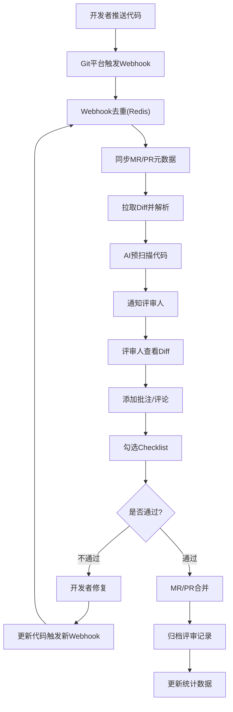
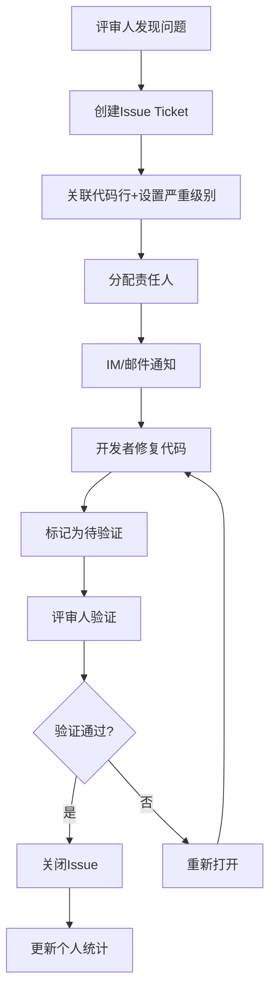

## 1. 产品概述

协作式代码审查平台是一个面向技术团队的全流程代码评审管理系统，解决当前评审散落在GitLab MR评论、Slack讨论和Confluence文档中的碎片化问题，提供统一的评审checklist、问题追踪和统计复盘能力。

- **核心价值**：将代码评审从分散的沟通渠道整合为结构化的流程管理，提升评审质量和效率，沉淀团队评审经验
- **目标用户**：技术团队的开发者、评审人、Tech Lead、架构师和工程管理者

## 2. 核心功能

### 2.1 用户角色

| 角色 | 注册方式 | 核心权限 |
|------|----------|----------|
| Owner | OAuth登录 | 组织级管理、成员邀请、角色分配、仓库配置 |
| Maintainer | OAuth登录 | 团队管理、仓库配置、Checklist模板管理、统计看板 |
| Reviewer | OAuth登录 | 代码评审、批注、问题创建、Checklist勾选 |
| Developer | OAuth登录 | 提交MR/PR、查看评审意见、修复问题、响应评论 |

### 2.2 功能模块

1. **登录页**：OAuth认证（GitHub/GitLab/Gitee）、会话管理
2. **仪表盘**：待评审列表、我的评审、问题统计、快捷操作
3. **仓库管理**：仓库列表、Webhook配置、OAuth绑定、同步状态
4. **MR/PR列表**：合并请求列表、筛选搜索、状态展示
5. **评审详情页**：Diff展示、行级批注、文件级批注、threaded讨论
6. **Checklist管理**：模板列表、模板编辑、项目/仓库级继承配置
7. **问题追踪**：问题列表、详情、状态流转、责任人分配、严重级别
8. **统计看板**：评审覆盖率、平均响应时间、问题密度热力图、个人缺陷发现率
9. **通知中心**：消息列表、通知设置、IM集成配置
10. **团队管理**：组织/团队/仓库三级结构、成员管理、角色分配、权限配置
11. **AI评审**：AI扫描结果、代码风格建议、Bug模式提示、人工确认

### 2.3 页面详情

| 页面名称 | 模块名称 | 功能描述 |
|----------|----------|----------|
| 登录页 | OAuth登录区 | GitHub/GitLab/Gitee三方OAuth登录、记住登录状态 |
| 仪表盘 | 概览卡片 | 待评审数量、我提交的MR、我的问题、评审统计概览 |
| 仪表盘 | 活动时间线 | 最新评审活动、评论、问题状态变更 |
| MR/PR列表 | 筛选区 | 按仓库、状态、作者、评审人、时间范围筛选 |
| MR/PR列表 | 数据表格 | MR标题、仓库、分支、作者、评审人、状态、更新时间 |
| 评审详情页 | Diff展示区 | 左右对比Diff、语法高亮、行号定位、折叠展开 |
| 评审详情页 | 批注区 | 行级批注气泡、文件级批注、回复讨论、解决标记 |
| 评审详情页 | Checklist区 | 逐项勾选、评审人记录、未通过项高亮 |
| 评审详情页 | AI建议区 | AI扫描结果、可采纳/忽略、参考依据 |
| 问题追踪页 | 问题列表 | 筛选、严重级别标签、状态标签、责任人 |
| 问题追踪页 | 问题详情 | 代码上下文、讨论历史、状态流转记录 |
| 统计看板 | 覆盖率图表 | 按仓库/时间的评审覆盖率趋势图 |
| 统计看板 | 热力图 | 问题密度按文件/模块热力分布 |
| 统计看板 | 个人统计 | 缺陷发现率、修复率、评审数量排名 |
| 团队管理页 | 组织结构树 | 组织-团队-仓库三级树形展示 |
| 团队管理页 | 成员管理 | 成员列表、角色分配、邀请/移除 |
| 仓库设置页 | 集成配置 | Webhook URL、Secret、OAuth配置、同步触发 |
| Checklist模板页 | 模板编辑器 | 分组、检查项、描述、继承关系配置 |

## 3. 核心流程

### 3.1 MR/PR评审主流程

开发者推送代码到Git托管平台，触发Webhook同步MR/PR元数据到评审平台，系统自动拉取Diff并进行AI预扫描，评审人收到通知后进行人工评审，通过Checklist逐项检查并添加批注，开发者根据评审意见修复代码，最终MR/PR合并后系统记录完整评审历史用于统计分析。

### 3.2 问题追踪流程

评审人在代码中发现问题后创建Issue Ticket，关联具体代码行并设置严重级别和责任人，系统自动通知责任人，开发者修复后标记为待验证，评审人验证通过后关闭问题，整个过程记录用于个人缺陷发现率和修复率统计。

## 4. 用户界面设计

### 4.1 设计风格

- **主色调**：深邃海军蓝 `#0F172A` 作为主背景，搭配科技蓝 `#3B82F6` 作为主交互色，强调专业严谨的技术氛围
- **辅助色**：成功绿 `#10B981`、警告橙 `#F59E0B`、危险红 `#EF4444`、信息紫 `#8B5CF6`，用于状态和严重级别标识
- **字体**：代码区使用 `JetBrains Mono` 等宽字体，界面文本使用 `Inter` 无衬线字体，保证代码可读性和界面清晰度
- **布局风格**：左侧导航栏 + 顶部操作栏 + 主内容区的经典企业级应用布局，Diff页采用左右分栏对比布局
- **视觉元素**：代码行号条纹背景、批注气泡阴影、Diff区块的 +/- 绿色/红色背景、细微网格纹理增加科技感

### 4.2 页面设计概述

| 页面名称 | 模块名称 | UI元素 |
|----------|----------|--------|
| 登录页 | 登录卡片 | 渐变背景、三方OAuth按钮、品牌Logo、微动效入场 |
| 仪表盘 | 统计卡片 | 大数字展示、趋势小图、悬停上浮效果、渐变色块 |
| 评审详情页 | Diff区域 | 左右对比、语法高亮、行号悬停高亮、批注气泡锚点 |
| 评审详情页 | 批注气泡 | 聊天气泡样式、回复缩进、解决状态切换、@提及 |
| 评审详情页 | Checklist | 分组折叠、勾选动画、未通过项红色边框、评审人头像 |
| 统计看板 | 热力图 | 网格色块、颜色深浅表示问题密度、悬停显示详情 |
| 统计看板 | 趋势图 | 平滑曲线、渐变填充、交互式数据点 |
| 问题追踪页 | 问题卡片 | 严重级别色条、状态标签、代码上下文预览 |
| 团队管理页 | 组织结构树 | 树形展开动画、角色徽章、拖拽调整 |

### 4.3 响应式

- **桌面优先**：针对1440px+宽屏优化，Diff区域充分利用横向空间展示代码对比
- **平板适配**：1024px时顶部导航折叠为汉堡菜单，Diff区域改为上下布局
- **移动适配**：768px以下简化为列表视图，主要功能可操作，Diff查看采用水平滚动
- **触控优化**：移动端增大点击区域，支持滑动手势切换MR/PR列表

### 4.4 交互动效

- **页面过渡**：页面切换采用淡入 + 轻微上移动画，持续200ms
- **Diff加载**：代码行逐行淡入渲染，新增行绿色扫光效果，删除行红色淡出效果
- **批注交互**：点击行号弹出批注框采用弹性动画，气泡悬停有轻微上浮阴影
- **通知提醒**：新通知采用右上角滑入动画，数字角标有脉冲效果
- **数据更新**：统计数据变化采用数字滚动动画，图表数据平滑过渡
