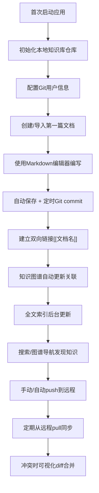

## 1. 产品概述
KnowledgeForge - 跨平台本地Markdown知识库管理桌面应用，解决技术团队和个人开发者笔记分散、格式不统一、搜索困难、离线访问不稳定的问题。
- 核心价值：本地数据主权 + Git版本控制 + 双向链接知识网络 + 全文检索 + 可扩展插件系统
- 目标用户：技术团队、个人开发者、知识工作者，需要统一管理分散在Notion、Obsidian、语雀和本地的技术文档

## 2. 核心特性

### 2.1 用户角色
| 角色 | 注册方式 | 核心权限 |
|------|----------|----------|
| 本地用户 | 无需注册，首次启动初始化本地仓库 | 完全控制本地知识库、Git同步、插件安装、导出导入 |

### 2.2 功能模块
1. **知识库仪表盘**：文档统计、最近编辑、标签云、快捷操作入口
2. **Markdown编辑器**：分屏实时预览、KaTeX数学公式、Mermaid流程图、代码高亮、主题切换、WYSIWYG/源码模式
3. **知识图谱**：D3力导向图、双向链接可视化、标签过滤、节点跳转、PNG导出
4. **全文搜索**：中英文混合搜索、标题加权、标签筛选、时间排序、结果高亮
5. **Git版本管理**：仓库初始化、自动commit、手动commit、push/pull、diff查看、冲突合并
6. **文档模板**：每日笔记、会议记录、项目复盘、API文档、技术方案等模板
7. **导入导出**：从Notion/语雀ZIP批量导入、多格式导出
8. **插件系统**：插件市场、沙箱运行、扩展编辑器/侧边栏/导入导出/AI功能

### 2.3 页面详情
| 页面名称 | 模块名称 | 功能描述 |
|----------|----------|----------|
| 仪表盘 | 统计概览 | 文档总数、字数统计、今日编辑、最近7天活跃度图表 |
| 仪表盘 | 最近文档 | 最近编辑的10篇文档卡片，支持快速打开 |
| 仪表盘 | 标签云 | 按文档数量展示标签，点击筛选 |
| 编辑器 | 工具栏 | 常用格式化按钮、插入模板、插入链接、导出 |
| 编辑器 | 分屏编辑区 | 左侧源码/右侧预览，支持拖拽调整比例，可切换单屏模式 |
| 编辑器 | 大纲侧边栏 | 自动解析H1-H6标题生成大纲，点击跳转 |
| 编辑器 | 反向链接面板 | 显示引用当前文档的其他文档列表 |
| 知识图谱 | 力导向图 | 可拖拽、缩放的节点关联图，文档节点+标签节点双色区分 |
| 知识图谱 | 过滤面板 | 按标签筛选、按时间范围筛选、搜索节点 |
| 知识图谱 | 操作栏 | 重置视图、切换布局、导出PNG |
| 搜索页 | 搜索栏 | 支持关键词、标签筛选、排序选项 |
| 搜索页 | 结果列表 | 标题高亮、关键词上下文片段、标签、修改时间 |
| Git面板 | 状态区 | 显示变更文件列表、工作区状态、分支信息 |
| Git面板 | 提交区 | 输入提交信息、选择文件、提交按钮 |
| Git面板 | 历史区 | 提交历史列表、查看diff、回滚 |
| Git面板 | 同步区 | push/pull按钮、远程仓库配置、进度显示 |
| 模板库 | 模板列表 | 内置模板卡片，预览+使用 |
| 模板库 | 自定义模板 | 用户自定义模板管理 |
| 导入页 | Notion导入 | 上传ZIP、解析映射、批量导入 |
| 导入页 | 语雀导入 | 上传ZIP、解析映射、批量导入 |
| 插件市场 | 插件列表 | 分类浏览、安装/卸载/启用/禁用 |
| 插件市场 | 已安装 | 管理已安装插件、配置 |
| 设置页 | 通用设置 | 主题、语言、默认编辑器模式 |
| 设置页 | Git设置 | 用户名、邮箱、远程仓库、SSH密钥 |
| 设置页 | 编辑器设置 | 字体、字号、制表符、自动保存间隔 |
| 设置页 | 存储设置 | 仓库路径、备份、数据迁移 |

## 3. 核心流程

用户主要工作流：
1. 新建/导入文档 → 分屏编辑 → 自动保存 → Git提交 → 知识关联
2. 搜索/图谱浏览 → 发现相关文档 → 跳转阅读 → 建立新链接
3. 多设备同步 → pull更新 → 处理冲突 → 继续工作

## 4. 用户界面设计

### 4.1 设计风格
- **主色调**：深科技蓝 `#1E40AF`，强调知识的专业性和科技感
- **辅助色**：翡翠绿 `#059669`（链接/关联）、琥珀橙 `#D97706`（警告/变更）、紫罗兰 `#7C3AED`（标签/分类）
- **背景色**：深色模式为主 `#0F172A`，浅色模式 `#F8FAFC`，支持自动切换
- **按钮风格**：圆角8px，悬浮时轻微上浮+阴影，点击时按压反馈
- **字体**：标题使用 `JetBrains Mono` 等宽字体体现技术感，正文使用 `Inter` 保证可读性，代码块使用 `Fira Code` 支持连字
- **布局风格**：三栏式布局（左侧导航+中间内容+右侧边栏），可折叠/展开，支持拖拽调整宽度
- **图标风格**：Lucide线性图标，统一20px尺寸，颜色随主题自适应

### 4.2 页面设计概述
| 页面名称 | 模块名称 | UI元素 |
|----------|----------|--------|
| 仪表盘 | 统计概览 | 渐变卡片、数字动画、迷你折线图、图标点缀 |
| 仪表盘 | 最近文档 | 卡片网格、悬浮放大效果、日期徽标、标签胶囊 |
| 编辑器 | 分屏编辑区 | CodeMirror编辑器带行号、滚动条、选区高亮；预览区CSS主题渲染、平滑滚动 |
| 编辑器 | 大纲侧边栏 | 层级缩进、当前行高亮、悬浮折叠按钮 |
| 知识图谱 | 力导向图 | SVG渲染、节点光晕、连线渐变色、拖拽阴影、缩放动画 |
| 知识图谱 | 过滤面板 | 多选标签胶囊、滑块控件、开关按钮 |
| 搜索页 | 结果列表 | 关键词`<mark>`高亮、渐变左侧边栏表示匹配度、时间戳相对显示 |
| Git面板 | diff查看 | 左右对比、删除红底、添加绿底、行号对齐 |
| 设置页 | 分组卡片 | 毛玻璃效果、分组标题、右侧对齐控件 |

### 4.3 响应式设计
- **桌面端**（1280px+）：三栏完整布局，图谱展开
- **中端**（1024-1279px）：右侧边栏默认折叠，图标按钮切换
- **移动端**（<1024px）：Electron桌面端以1024px为最小窗口尺寸，不支持更小
- 所有拖拽区域显示可拖拽光标，悬浮时有视觉反馈

### 4.4 交互与动效
- 页面切换：左侧滑入新内容，渐隐渐现，时长200ms
- 知识图谱：节点进入时弹性动画，连线呼吸效果
- 编辑器：输入时实时预览同步滚动，平滑滚动
- 按钮点击：微缩放 + 波纹扩散效果
- 标签云：按数量不同字体大小，悬浮时放大+阴影
- 搜索结果：逐个淡入，延迟100ms递增
