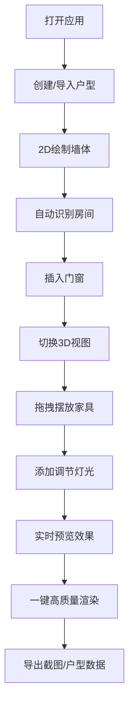

## 1. 产品概述

ArchPlan Studio 是一款面向室内设计师的网页端建筑平面图编辑器，让设计师无需安装重型桌面CAD软件，即可在浏览器中快速完成户型绘制、家具摆放、灯光调节，并实时预览3D效果，快速向客户展示"这个沙发摆这里光线怎么样"的直观效果。

- **核心价值**：降低设计工具门槛，提升设计沟通效率，快速呈现设计方案的空间感和光影效果
- **目标用户**：室内设计师、家装顾问、房产销售
- **目标市场**：家装设计行业的快速方案展示与客户沟通场景

## 2. 核心功能

### 2.1 用户角色

| 角色 | 注册方式 | 核心权限 |
|------|----------|----------|
| 设计师 | 本地账号 / 匿名使用 | 户型绘制、家具摆放、灯光调节、渲染导出、本地存储 |
| 协作用户 | 邀请链接加入 | 查看户型、添加批注、实时同步 |

### 2.2 功能模块

1. **编辑器主界面**：2D/3D视图切换、工具栏、属性面板、图层管理
2. **2D绘制引擎**：直线墙/弧墙绘制、自动闭合识别、尺寸标注、网格对齐
3. **3D场景管理**：2D转3D拉伸、门窗开洞、材质贴图、相机控制
4. **材质与家具库**：PBR材质系统、glTF模型库、拖拽摆放、碰撞检测
5. **实时灯光模拟**：点光源/面光源/射灯/环境光、实时阴影、亮度调节
6. **数据导入导出**：DXF导入解析、JSON户型格式导出、高分辨率截图
7. **协作批注系统**：多人查看、3D位置批注、文字+截图、实时同步
8. **测量与报价工具**：距离/面积/体积测量、材料单价关联、自动报价单

### 2.3 页面详情

| 页面名称 | 模块名称 | 功能描述 |
|----------|----------|----------|
| 编辑器主页面 | 顶部工具栏 | 视图切换（2D/3D/透视）、操作撤销/重做、导入/导出、渲染模式 |
| 编辑器主页面 | 左侧工具箱 | 墙体绘制工具（直线/弧线）、门窗插入、测量工具、批注工具、家具选择器 |
| 编辑器主页面 | 中央画布区 | 2D Canvas绘制区 / 3D Three.js渲染区，双视图可分屏 |
| 编辑器主页面 | 右侧属性面板 | 选中对象属性编辑、材质选择、灯光参数、墙体参数 |
| 编辑器主页面 | 底部状态栏 | 网格尺寸显示、当前坐标、角度约束状态、选中信息 |
| 家具库面板 | 分类浏览 | 按房间类型/家具类型分类的3D模型库，预览缩略图 |
| 渲染设置面板 | 渲染参数 | 光线追踪质量、输出分辨率、抗锯齿设置、一键渲染 |
| 报价面板 | 报价计算 | 材料清单、单价设置、自动计算、导出报价单 |

## 3. 核心流程

设计师打开应用后，从空白画布开始绘制墙体，系统自动识别闭合区域形成房间。插入门窗后切换到3D视图查看立体效果。从家具库拖拽家具到房间内摆放，调整位置和角度。添加灯光并调节参数，实时查看光影效果。满意后可一键高质量渲染并导出截图，或导出JSON户型数据供下游使用。

## 4. 用户界面设计

### 4.1 设计风格

- **设计方向**：专业工业风 + 极简主义，强调工具感和专业性
- **主色调**：深灰蓝 `#1a1f2e` 作为画布背景，突出建筑线条
- **强调色**：暖橙色 `#ff6b35` 用于选中高亮和操作按钮，科技感青色 `#00d4ff` 用于辅助操作和预览
- **中性色**：分层灰色系 `#f8f9fa` / `#e9ecef` / `#adb5bd` / `#495057`
- **按钮风格**：扁平化直角按钮，悬停时轻微上浮+发光边框，工具按钮使用图标+tooltip
- **字体**：标题使用 `Space Grotesk` 工业风无衬线字体，正文使用 `Inter` 保证可读性，等宽字体 `JetBrains Mono` 用于数值输入和坐标显示
- **布局风格**：三栏式专业布局，顶部固定工具栏，中央大画布区，两侧可折叠面板，支持面板拖拽重组
- **图标风格**：线性outline风格图标，统一24px网格，使用lucide-react图标库

### 4.2 页面设计概览

| 页面名称 | 模块名称 | UI元素 |
|----------|----------|--------|
| 编辑器主页面 | 顶部工具栏 | 深色背景，左侧logo+项目名，中间视图切换按钮组，右侧导入导出/渲染按钮，按钮间距16px，高度56px |
| 编辑器主页面 | 左侧工具箱 | 垂直工具栏，宽度64px，图标按钮32px间距，选中时左侧橙色边框高亮，hover显示tooltip |
| 编辑器主页面 | 中央画布区 | 深灰蓝背景，带浅色网格线，2D模式下墙体白色线条，3D模式下PBR材质，阴影柔和 |
| 编辑器主页面 | 右侧属性面板 | 宽度280px，可折叠，卡片式分组，每组标题14px粗体，属性行标签+数值输入 |
| 家具库面板 | 模型列表 | 网格布局，每行3个卡片，卡片带悬停放大效果，点击显示详情和放置按钮 |
| 渲染设置面板 | 参数表单 | 滑块+数值输入组合，预设按钮组，一键渲染大按钮带脉冲动画 |

### 4.3 响应式

- **桌面优先**：针对1920×1080及以上分辨率优化，三栏布局充分利用屏幕空间
- **平板适配**：1024-1440px宽度，面板自动调整宽度，可折叠为图标模式
- **触摸优化**：画布支持双指缩放和旋转，工具栏按钮最小44px触控尺寸
- **窄屏处理**：<1024px时单栏布局，面板改为底部抽屉模式

### 4.4 3D场景指引

- **环境氛围**：中性冷灰环境光搭配柔和HDRI，突出家具材质质感，避免过度花哨的环境反射
- **光照设置**：默认三盏灯配置——主光源（暖白聚光45°）、补光（冷白环境光）、轮廓光（冷白背光），用户可自定义添加
- **相机设置**：默认透视相机，FOV 50°，初始视角45°俯角，支持轨道控制器旋转/缩放/平移，预设正交顶视图/正视图快捷键
- **构图与焦点**：墙体和家具按真实比例渲染，选中物体显示橙色轮廓高亮，操作时有轻微动画反馈
- **交互与动画**：家具拖拽时有半透明预览体，释放时弹性动画落位，视图切换有500ms平滑过渡，灯光调节实时更新无延迟
- **后处理效果**：默认开启轻微Bloom效果（强度0.3）和环境光遮蔽（AO强度0.5），高质量渲染模式开启SSR和路径追踪
- **资源来源与性能**：家具模型使用glTF格式压缩，单模型不超过5MB，场景最多同时渲染20个动态阴影，帧率目标保持60fps
