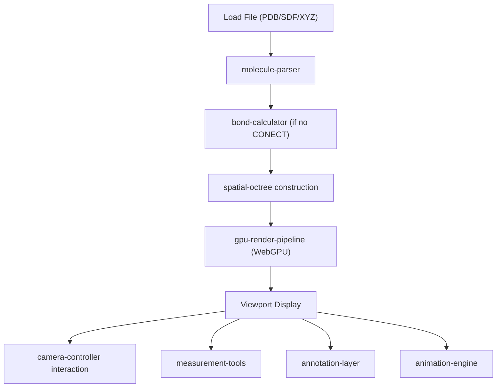

## 1. Product Overview

MolVis is a hardware-accelerated molecular structure visualization application for computational chemists who need to interactively explore large biomolecular complexes (500,000+ atoms). Built with TypeScript and WebGPU, it delivers real-time rendering of PDB, SDF, and XYZ files with professional-grade measurement, annotation, and animation tools.

- Target user: Computational chemists, structural biologists, and medicinal chemists
- Core value: Smooth, interactive exploration of massive molecular structures directly in the browser without desktop software

## 2. Core Features

### 2.1 User Roles

| Role | Access Method | Core Permissions |
|------|---------------|------------------|
| Researcher | Direct access (no registration) | Load files, visualize, measure, annotate, animate |
| Viewer | Direct access (no registration) | View pre-loaded structures, rotate/zoom only |

### 2.2 Feature Modules

1. **Viewport page**: 3D molecular rendering canvas with camera controls and toolbar overlays
2. **File panel**: Drag-and-drop file loader with format auto-detection and multi-model selection
3. **Measurement panel**: Interactive distance/angle/dihedral measurement tools with visual guides
4. **Animation panel**: Conformational state interpolation controls with timeline scrubber

### 2.3 Page Details

| Page Name | Module Name | Feature description |
|-----------|-------------|---------------------|
| Viewport | 3D Canvas | WebGPU-accelerated sphere/cylinder impostor rendering with PBR shading and ambient occlusion |
| Viewport | Camera Controls | Orbit, trackball, and first-person fly modes with momentum-based smooth interpolation |
| Viewport | Annotation Overlay | Residue labels, backbone trace ribbons, hydrogen bond donor/acceptor indicators |
| File Panel | File Loader | Drag-and-drop loading of PDB, SDF, XYZ files with multi-model NMR ensemble support and CONECT bond parsing |
| File Panel | Bond Calculator | Automatic covalent bond inference from interatomic distances when CONECT records absent |
| Measurement Panel | Distance Tool | Click two atoms to measure interatomic distance with on-screen line and label |
| Measurement Panel | Angle Tool | Click three atoms to measure bond angle with arc guide |
| Measurement Panel | Dihedral Tool | Click four atoms to measure dihedral angle with plane guides |
| Animation Panel | State Interpolator | Load multiple conformations, interpolate with linear or smooth-step easing, timeline scrub |

## 3. Core Process

The user loads a molecular file → the parser extracts atoms, bonds, and metadata → the spatial octree is constructed → the GPU render pipeline draws atoms as sphere impostors and bonds as cylinder impostors with PBR shading → the user interacts via camera controls, takes measurements, toggles annotations, or plays conformational animations.

## 4. User Interface Design

### 4.1 Design Style

- **Primary color**: Deep charcoal (#1a1a2e) background for molecular viewport — maximizes contrast with colored atoms
- **Secondary color**: Teal accent (#00d4aa) for active tools, selections, and highlights
- **Tertiary color**: Warm amber (#f0a500) for measurement readouts and warnings
- **Surface color**: Semi-transparent dark panels (rgba(20, 20, 40, 0.85)) with frosted-glass backdrop blur
- **Typography**: "JetBrains Mono" for numeric readouts and data, "DM Sans" for UI labels
- **Button style**: Minimal icon buttons with subtle hover glow, grouped in vertical toolbars
- **Layout style**: Full-viewport canvas with floating collapsible panels on the left and bottom edges
- **Icon style**: Lucide icons, 20px, monochrome with teal accent on active state

### 4.2 Page Design Overview

| Page Name | Module Name | UI Elements |
|-----------|-------------|-------------|
| Viewport | 3D Canvas | Full-window WebGPU canvas, dark background, atom coloring by element (CPK scheme), PBR shading with screen-space AO |
| Viewport | Camera toolbar | Top-right floating vertical toolbar: orbit/trackball/fly mode toggles, reset view button |
| Viewport | Annotation toggles | Left-side floating panel: checkbox toggles for residue labels, backbone ribbons, H-bond indicators |
| File Panel | File loader | Left-side collapsible panel: drag-drop zone, file list, model selector dropdown for multi-model files |
| Measurement Panel | Measurement tools | Right-side floating panel: distance/angle/dihedral tool buttons, results table with atom indices and values |
| Animation Panel | Animation controls | Bottom-edge collapsible bar: play/pause, timeline scrubber, easing selector, frame counter |

### 4.3 Responsiveness

- Desktop-first design (primary use case is workstation with large monitor)
- Minimum viewport: 1280×720
- Canvas auto-resizes with window; panels reflow on narrow viewports
- Touch support for orbit/zoom on tablets (secondary use case)

### 4.4 3D Scene Guidance

- **Environment**: Dark void background with subtle gradient fog for depth perception
- **Lighting**: Three-point lighting setup — key light (warm white, upper-left), fill light (cool blue, lower-right), rim light (teal, from camera direction); implemented as PBR punctual lights
- **Camera**: Perspective projection, 60° FOV, near=0.1, far=1000; auto-frames loaded structure
- **Atom rendering**: Sphere impostors (ray-cast quadrilaterals) with van der Waals radius scaling per element
- **Bond rendering**: Cylinder impostors connecting bonded atoms with proper radius
- **Post-processing**: Screen-space ambient occlusion for depth, optional bloom for highlights
- **LOD**: Octree-driven level-of-detail — distant atoms rendered as smaller/fewer primitives
- **Performance target**: 30+ FPS at 500K atoms on mid-range GPU (e.g., RTX 3060)
