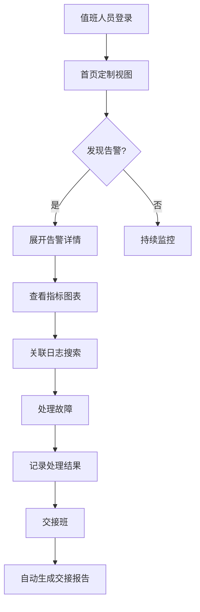
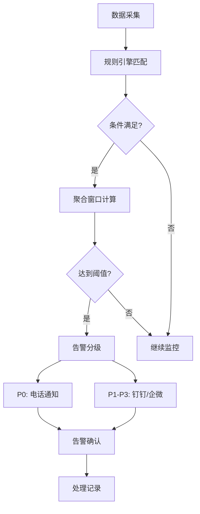

## 1. 产品概述

本产品是面向运维团队的内部实时监控大盘，旨在解决多系统运维状态分散、夜间故障响应慢的痛点。通过聚合微服务、数据库、消息队列、服务器等多维度监控数据，提供统一的可视化管理界面，实现"一个页面掌控全局"的运维目标。

- 主要解决问题：运维值班需同时切换多个管理后台查看系统状态，故障发现与响应效率低
- 目标用户：SRE运维工程师、DBA、技术值班人员
- 产品价值：缩短故障响应时间，提升运维效率，降低夜间值守压力

## 2. 核心功能

### 2.1 用户角色

| 角色 | 注册方式 | 核心权限 |
|------|----------|----------|
| 运维管理员 | 系统创建 | 全部模块权限、用户管理、规则配置 |
| 运维值班 | 系统创建 | 大盘查看、告警处理、交接记录 |
| 只读用户 | 系统创建 | 仅查看大盘和历史数据 |

### 2.2 功能模块

1. **首页个人定制视图**：可拖拽布局，Pin常用组件到首页
2. **服务健康聚合面板**：微服务健康状态三色卡片展示，支持展开详情
3. **时序指标折线图**：CPU/内存/QPS趋势图，支持24小时数据查看
4. **告警规则引擎**：阈值配置、分级告警（P0-P3）、多渠道通知
5. **慢SQL采集分析器**：SQL执行计划分析、指纹聚合统计
6. **资产配置管理**：服务器/数据库/中间件资产管理、变更追踪
7. **值班排班与交接**：轮班管理、交接报告自动生成
8. **日志采集搜索**：Elasticsearch对接、全文检索、查询模板

### 2.3 页面详情

| 页面名称 | 模块名称 | 功能描述 |
|----------|----------|----------|
| 首页 | 个人定制视图 | 拖拽式组件布局、Pin管理、快捷跳转 |
| 服务健康 | 健康面板 | 每30秒轮询health端点、绿黄红三色卡片、展开详情 |
| 指标监控 | 时序图表 | Prometheus数据对接、Chart.js渲染、HTMX局部刷新 |
| 告警中心 | 告警引擎 | 规则配置、阈值触发、P0电话告警、钉钉/企微通知 |
| SQL分析 | 慢查询面板 | 执行计划解析、指纹聚合、趋势统计 |
| 资产管理 | CMDB面板 | 资产录入、版本管理、负责人分配、变更日志 |
| 值班管理 | 排班交接 | 轮班日历、临时换班、交接报告自动生成 |
| 日志搜索 | 日志面板 | ES全文检索、时间范围过滤、查询模板保存 |
| 个人设置 | 偏好设置 | 视图定制、通知方式配置 |

## 3. 核心流程

### 3.1 日常运维监控流程

值班人员登录系统 → 首页查看个人定制的关键指标 → 发现告警卡片变红 → 点击展开查看详情 → 关联查看对应服务的指标图表和日志 → 处理故障 → 记录处理结果 → 交接班时自动汇总当班告警和变更

### 3.2 告警触发流程

服务健康检查 → 指标数据采集 → 规则引擎匹配 → 阈值条件判断 → 聚合窗口计算 → 触发告警 → 分级通知（P0电话/P1-P3钉钉/企微）→ 告警确认与处理

## 4. 用户界面设计

### 4.1 设计风格

- 主色调：深空灰 #1a1f2e 作为背景，营造专业运维控制台氛围
- 强调色：
  - 健康绿 #22c55e（正常状态）
  - 警告黄 #f59e0b（警告状态）
  - 危险红 #ef4444（故障状态）
  - 信息蓝 #3b82f6（交互元素）
- 字体：JetBrains Mono 等宽字体作为数据展示，Inter 作为界面文字
- 布局：顶部导航 + 左侧Tab菜单 + 主内容区的经典控制台布局
- 风格：深色运维控制台风格，高对比度数据展示，减少视觉疲劳
- 图标：使用Lucide图标库，保持线条风格统一

### 4.2 页面设计概述

| 页面名称 | 模块名称 | UI元素 |
|----------|----------|--------|
| 首页 | 定制视图 | 可拖拽卡片网格、Pin按钮、组件添加器、布局保存 |
| 服务健康 | 健康面板 | 三色状态卡片网格、30秒刷新指示器、展开/收起动画、详细指标抽屉 |
| 指标监控 | 时序图表 | 时间范围选择器、指标切换Tab、Chart.js折线图、HTMX刷新按钮 |
| 告警中心 | 告警引擎 | 规则列表、阈值配置表单、告警历史时间线、通知渠道配置 |
| SQL分析 | 慢查询面板 | 指纹聚合列表、执行计划详情、趋势图表、Top 10慢查询 |
| 资产管理 | CMDB面板 | 分类Tab、资产卡片、负责人头像、变更日志时间线 |
| 值班管理 | 排班交接 | 日历视图、换班按钮、交接报告预览、历史交接记录 |
| 日志搜索 | 日志面板 | 搜索栏、过滤条件、日志列表高亮、模板保存按钮 |

### 4.3 响应性

- 设计原则：Desktop-first，针对运维大屏优化
- 主显示器：1920x1080及以上分辨率最优，支持2K/4K大屏展示
- 笔记本适配：1280px断点优化，Tab菜单可折叠
- 移动端：最小支持到1024px宽度，保证核心监控功能可用
- 交互：鼠标悬停效果、点击反馈、键盘快捷键支持

### 4.4 动效与交互

- 数据刷新：新数据滑入效果，状态变化时颜色渐变过渡
- 告警闪烁：P0告警卡片脉冲动画，吸引注意力
- 卡片展开：平滑高度过渡，内容淡入
- Tab切换：内容区左右滑动切换
- 图表加载：骨架屏脉冲动画，数据点逐个绘制
