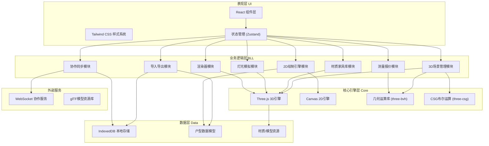
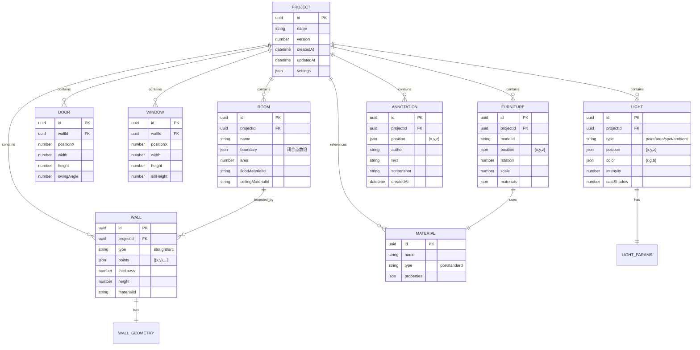

## 1. 架构设计

本项目采用前端单页应用架构，基于React + TypeScript + Vite构建，集成Three.js进行3D渲染，Canvas API进行2D绘制，IndexedDB进行本地数据持久化，WebSocket实现多人协作。整体采用分层架构，确保各模块职责清晰、易于扩展。



## 2. 技术描述

- **前端框架**：React 18 + TypeScript 5.4 + Vite 5.2
- **样式方案**：Tailwind CSS 3.4，CSS变量主题系统
- **状态管理**：Zustand 4.5，分模块管理户型、UI、设置状态
- **3D渲染**：Three.js r162，@react-three/fiber 8.15，@react-three/drei 9.99
- **后处理**：@react-three/postprocessing 2.16，实现SSAO、Bloom、SSR效果
- **几何运算**：three-bvh 0.7.0（碰撞检测、光线投射加速），three-csg-ts 3.2.0（墙体开洞布尔运算）
- **模型加载**：@react-three/gltfjsx 转化glTF模型为React组件
- **DXF解析**：dxf-parser 1.1.2
- **本地存储**：idb 8.0.0（IndexedDB封装）
- **图标库**：lucide-react 0.378.0
- **后端服务**：无需后端核心逻辑，仅需可选的WebSocket协作服务器（Node.js + ws 8.16）

## 3. 路由定义

| 路由 | 用途 |
|------|------|
| `/` | 编辑器主页面，包含2D/3D画布、工具栏、属性面板 |
| `/projects` | 项目列表页，展示本地存储的所有户型项目 |
| `/render` | 独立渲染页面，用于高质量路径追踪渲染输出 |

## 4. 数据模型

### 4.1 数据模型定义



### 4.2 核心类型定义

```typescript
// 户型数据标准格式
interface FloorPlan {
  version: '1.0.0';
  project: Project;
  walls: Wall[];
  rooms: Room[];
  openings: Opening[];
  furniture: FurnitureItem[];
  lights: LightSource[];
  materials: Material[];
  annotations: Annotation[];
}

interface Wall {
  id: string;
  type: 'straight' | 'arc';
  start: Point2D;
  end: Point2D;
  center?: Point2D;
  radius?: number;
  thickness: number;
  height: number;
  materialId: string;
}

interface Room {
  id: string;
  name: string;
  boundary: Point2D[];
  area: number;
  floorMaterialId: string;
  ceilingMaterialId: string;
}

interface FurnitureItem {
  id: string;
  modelId: string;
  position: Point3D;
  rotation: number;
  scale: number;
  materialOverrides: Record<string, string>;
}

interface LightSource {
  id: string;
  type: 'point' | 'area' | 'spot' | 'ambient';
  position: Point3D;
  target?: Point3D;
  color: RGB;
  intensity: number;
  castShadow: boolean;
  params: Record<string, number>;
}
```

## 5. 目录结构

```
DF1-72/
├── src/
│   ├── components/          # React组件
│   │   ├── editor/          # 编辑器核心组件
│   │   │   ├── Canvas2D.tsx
│   │   │   ├── Scene3D.tsx
│   │   │   ├── Toolbar.tsx
│   │   │   ├── ToolPanel.tsx
│   │   │   ├── PropertyPanel.tsx
│   │   │   └── StatusBar.tsx
│   │   ├── furniture/       # 家具库组件
│   │   │   ├── FurnitureLibrary.tsx
│   │   │   └── ModelCard.tsx
│   │   ├── lighting/        # 灯光组件
│   │   │   └── LightPanel.tsx
│   │   ├── render/          # 渲染组件
│   │   │   └── RenderDialog.tsx
│   │   └── ui/              # 通用UI组件
│   │       ├── Button.tsx
│   │       ├── Slider.tsx
│   │       └── Input.tsx
│   ├── store/               # Zustand状态管理
│   │   ├── useFloorPlanStore.ts
│   │   ├── useUIStore.ts
│   │   └── useSettingsStore.ts
│   ├── hooks/               # 自定义Hooks
│   │   ├── useWallDrawing.ts
│   │   ├── useFurnitureDrag.ts
│   │   ├── useCameraControls.ts
│   │   └── useCollaboration.ts
│   ├── engine/              # 核心引擎模块
│   │   ├── drawing/         # 2D绘制引擎
│   │   │   ├── WallDrawer.ts
│   │   │   ├── DimensionMarker.ts
│   │   │   ├── GridSystem.ts
│   │   │   └── SnapManager.ts
│   │   ├── scene/           # 3D场景管理
│   │   │   ├── SceneManager.ts
│   │   │   ├── WallBuilder.ts
│   │   │   ├── OpeningCutter.ts
│   │   │   └── RoomGenerator.ts
│   │   ├── materials/       # 材质系统
│   │   │   ├── PBRMaterialFactory.ts
│   │   │   └── MaterialLibrary.ts
│   │   ├── lighting/        # 灯光系统
│   │   │   ├── LightManager.ts
│   │   │   └── ShadowManager.ts
│   │   ├── rendering/       # 渲染器
│   │   │   ├── PathTracingRenderer.ts
│   │   │   └── ScreenshotExporter.ts
│   │   └── physics/         # 物理/碰撞
│   │       ├── CollisionDetector.ts
│   │       └── MeasurementTool.ts
│   ├── io/                  # 导入导出
│   │   ├── DXFParser.ts
│   │   ├── FloorPlanExporter.ts
│   │   └── LocalStorage.ts
│   ├── types/               # TypeScript类型定义
│   │   ├── floorplan.ts
│   │   ├── geometry.ts
│   │   └── materials.ts
│   ├── utils/               # 工具函数
│   │   ├── geometry.ts
│   │   ├── math.ts
│   │   └── csg.ts
│   ├── pages/               # 页面组件
│   │   ├── EditorPage.tsx
│   │   ├── ProjectsPage.tsx
│   │   └── RenderPage.tsx
│   ├── App.tsx
│   ├── main.tsx
│   └── index.css
├── public/
│   ├── models/              # glTF模型资源
│   ├── textures/            # 材质纹理
│   └── hdri/                # HDR环境贴图
├── api/                     # 后端服务（可选）
│   └── collaboration/       # WebSocket协作服务
├── shared/                  # 前后端共享类型
│   └── types.ts
├── package.json
├── tsconfig.json
├── vite.config.ts
├── tailwind.config.js
└── postcss.config.js
```
