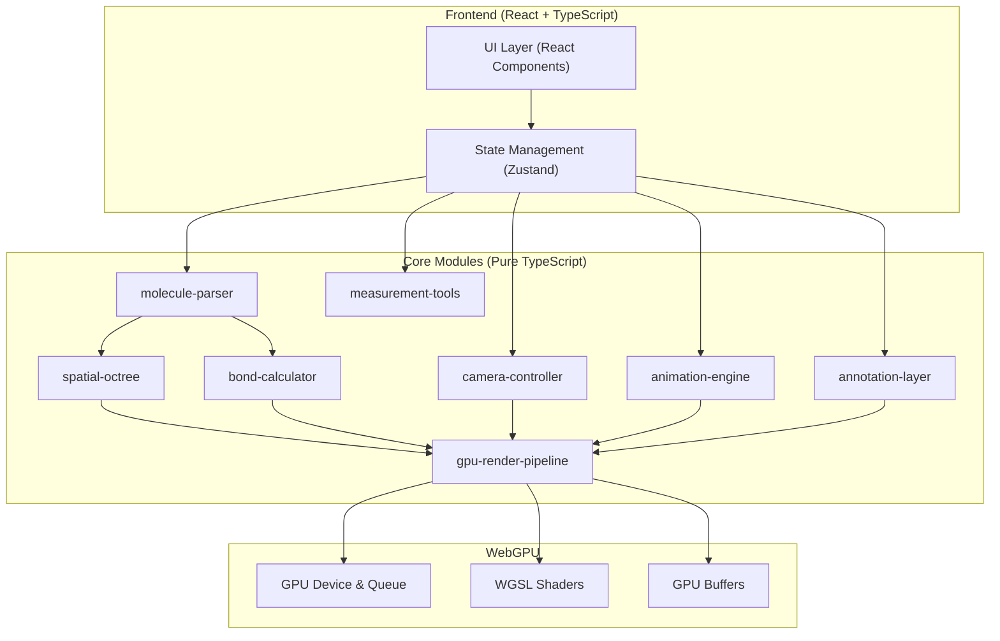
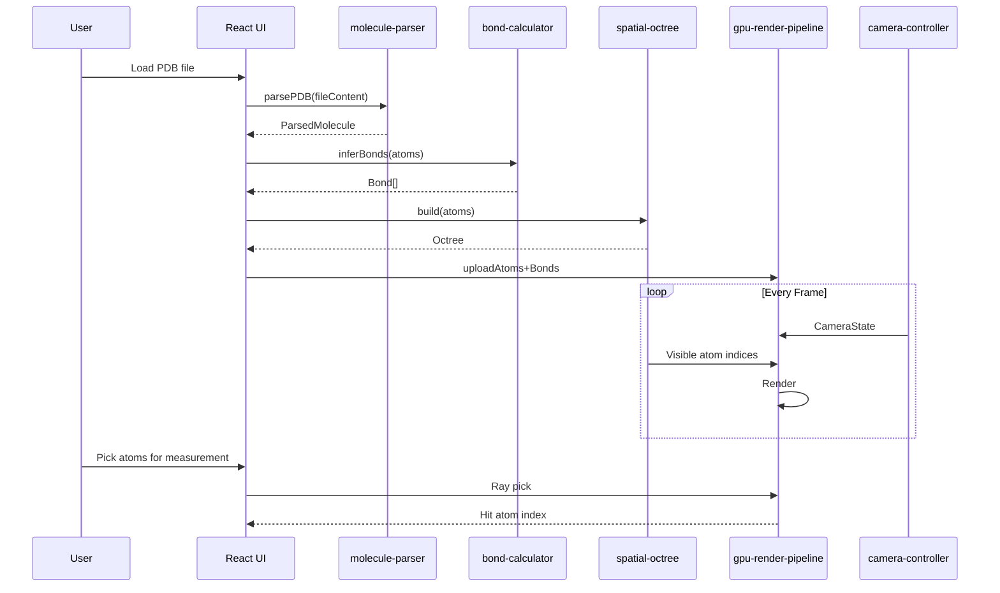

## 1. Architecture Design



## 2. Technology Description

- **Frontend**: React@18 + Tailwind CSS@3 + Vite
- **Initialization Tool**: vite-init (react-ts template)
- **Rendering**: Raw WebGPU API (no wrapper library) with WGSL shaders
- **State Management**: Zustand
- **Language**: TypeScript with strict mode enabled
- **Backend**: None (client-side only application)
- **Build Tool**: Vite with TypeScript plugin

### Key Technology Decisions

1. **WebGPU over Three.js**: Direct WebGPU access required for custom impostor rendering pipeline, compute-shader-driven octree traversal, and explicit memory management for 500K+ atom datasets
2. **Sphere/Cylinder Impostors**: Ray-cast quadrilateral impostors instead of tessellated meshes — reduces vertex count from millions to thousands while maintaining visual quality
3. **Compute Shader Octree**: Frustum culling and LOD selection executed on GPU via compute shaders to avoid CPU bottleneck
4. **No External 3D Library**: Full control over render pipeline for PBR material model and custom shader effects

## 3. Route Definitions

| Route | Purpose |
|-------|---------|
| `/` | Main viewport with all tools and panels |

Single-page application — all functionality accessible through floating panels on the viewport.

## 4. Module Architecture

### 4.1 molecule-parser

```typescript
interface ParsedMolecule {
  atoms: Atom[];
  bonds: Bond[];
  models: Model[];
  metadata: FileMetadata;
}

interface Atom {
  index: number;
  element: string;
  x: number; y: number; z: number;
  residue?: string;
  chainId?: string;
  occupancy?: number;
  bFactor?: number;
  vdWRadius: number;
  color: [number, number, number];
}
```

- **PDB parser**: Line-by-line ATOM/HETATM parsing, CONECT record extraction, multi-MODEL support for NMR ensembles
- **SDF parser**: Molfile V2000/V3000 atom/bond block parsing, property extraction
- **XYZ parser**: Simple coordinate parsing with element detection
- **Format auto-detection**: Based on file extension and content inspection
- **Validation**: Atom count consistency, coordinate range checks, element symbol validation

### 4.2 bond-calculator

```typescript
function inferBonds(atoms: Atom[], tolerance?: number): Bond[];
```

- Uses element-specific covalent radius tables
- Bond threshold = (r₁ + r₂) × tolerance factor (default 1.2)
- O(n·k) neighbor search using spatial hashing for performance
- Outputs Bond objects with atom indices and bond order estimation

### 4.3 spatial-octree

```typescript
class Octree {
  build(atoms: Atom[], maxDepth?: number, maxAtomsPerNode?: number): OctreeNode;
  cull(frustum: Frustum): number[];
  getLOD(cameraDistance: number): LODLevel;
}
```

- Recursive octree subdivision with configurable depth and leaf capacity
- GPU-friendly layout: flattened node array stored in GPU storage buffer
- Frustum culling via compute shader — each thread processes one octree node
- LOD levels: full detail (near), reduced impostor size (mid), point sprites (far)
- Rebuild trigger on significant camera movement or structure change

### 4.4 gpu-render-pipeline

```typescript
class RenderPipeline {
  init(device: GPUDevice, canvas: HTMLCanvasElement): void;
  uploadAtoms(atoms: Atom[], bonds: Bond[]): void;
  render(camera: CameraState, octree: Octree): void;
}
```

- **Atom impostors**: Screen-aligned quads, ray-sphere intersection in fragment shader
- **Bond impostors**: Screen-aligned quads, ray-cylinder intersection in fragment shader
- **PBR material**: Metallic-roughness workflow — albedo from CPK color, roughness=0.4, metallic=0.1
- **Ambient occlusion**: Screen-space AO via depth buffer resampling in half-res pass
- **Lighting**: 3 punctual lights + ambient term
- **Render passes**: (1) Depth pre-pass, (2) G-buffer fill, (3) SSAO, (4) PBR shading, (5) Annotation overlay
- **Indirect draw**: Uses `drawIndirect` with GPU-computed visible instance counts from octree culling

### 4.5 camera-controller

```typescript
type CameraMode = 'orbit' | 'trackball' | 'fly';

class CameraController {
  setMode(mode: CameraMode): void;
  update(dt: number): void;
  getState(): CameraState;
}
```

- **Orbit**: Spherical coordinates around pivot point, scroll to zoom, drag to rotate
- **Trackball**: Virtual trackball rotation with no gimbal lock (quaternion-based)
- **Fly**: WASD translation + mouse look, continuous velocity with exponential decay
- **Momentum**: Velocity persists after input release, decays with configurable damping factor
- **Smooth interpolation**: Slerp for rotation, lerp for position, with configurable responsiveness

### 4.6 measurement-tools

```typescript
type MeasurementType = 'distance' | 'angle' | 'dihedral';

interface Measurement {
  type: MeasurementType;
  atoms: number[];
  value: number;
}
```

- **Distance**: |p₂ - p₁| between two atoms
- **Angle**: arccos of normalized vectors (a₁→a₂) · (a₃→a₂)
- **Dihedral**: Signed angle between planes (a₁,a₂,a₃) and (a₂,a₃,a₄)
- **Visual guides**: Dashed lines for distance, arc for angle, semi-transparent planes for dihedral
- **Atom picking**: Ray-cast from mouse position through atom sphere impostors

### 4.7 animation-engine

```typescript
type EasingType = 'linear' | 'smoothstep';

class AnimationEngine {
  addState(name: string, atoms: Atom[]): void;
  setEasing(easing: EasingType): void;
  play(): void;
  pause(): void;
  seek(t: number): void;
  getCurrentAtoms(): Atom[];
}
```

- Stores array of conformational states (atom positions per state)
- Interpolates atom positions: `p(t) = lerp(p₀, p₁, ease(t))`
- Linear easing: `t` directly
- Smooth-step easing: `3t² - 2t³`
- Real-time update: interpolated positions uploaded to GPU each frame
- Timeline scrubber UI for manual seeking

### 4.8 annotation-layer

```typescript
class AnnotationLayer {
  setResidueLabels(visible: boolean): void;
  setBackboneRibbon(visible: boolean): void;
  setHBondIndicators(visible: boolean): void;
}
```

- **Residue labels**: Billboard text sprites at Cα positions, showing residue name + number
- **Backbone ribbon**: Cardinal spline through Cα positions, extruded as flat ribbon with orientation from peptide plane
- **H-bond indicators**: Dashed cylinders between donor and acceptor atoms, colored by strength (distance/angle criteria)
- Rendered as additional draw calls in the annotation render pass

## 5. Data Flow



## 6. Project Structure

```
DF1-17/
├── src/
│   ├── main.tsx                    # Entry point
│   ├── App.tsx                     # Root component
│   ├── store/
│   │   └── useMolStore.ts          # Zustand store
│   ├── modules/
│   │   ├── molecule-parser/
│   │   │   ├── index.ts
│   │   │   ├── pdb-parser.ts
│   │   │   ├── sdf-parser.ts
│   │   │   ├── xyz-parser.ts
│   │   │   ├── elements.ts         # Element data (vdW radii, colors)
│   │   │   └── types.ts
│   │   ├── bond-calculator/
│   │   │   ├── index.ts
│   │   │   ├── covalent-radii.ts
│   │   │   └── spatial-hash.ts
│   │   ├── spatial-octree/
│   │   │   ├── index.ts
│   │   │   ├── octree.ts
│   │   │   └── frustum.ts
│   │   ├── gpu-render-pipeline/
│   │   │   ├── index.ts
│   │   │   ├── pipeline.ts
│   │   │   ├── atom-impostor.ts
│   │   │   ├── bond-impostor.ts
│   │   │   ├── pbr-material.ts
│   │   │   ├── ssao.ts
│   │   │   └── shaders/
│   │   │       ├── atom-impostor.wgsl
│   │   │       ├── bond-impostor.wgsl
│   │   │       ├── pbr-shading.wgsl
│   │   │       ├── ssao.wgsl
│   │   │       ├── octree-cull.wgsl
│   │   │       └── common.wgsl
│   │   ├── camera-controller/
│   │   │   ├── index.ts
│   │   │   ├── orbit.ts
│   │   │   ├── trackball.ts
│   │   │   └── fly.ts
│   │   ├── measurement-tools/
│   │   │   ├── index.ts
│   │   │   ├── distance.ts
│   │   │   ├── angle.ts
│   │   │   ├── dihedral.ts
│   │   │   └── picking.ts
│   │   ├── animation-engine/
│   │   │   ├── index.ts
│   │   │   └── easing.ts
│   │   └── annotation-layer/
│   │       ├── index.ts
│   │       ├── residue-labels.ts
│   │       ├── backbone-ribbon.ts
│   │       └── hbond-indicators.ts
│   ├── components/
│   │   ├── Viewport.tsx
│   │   ├── FilePanel.tsx
│   │   ├── CameraToolbar.tsx
│   │   ├── MeasurementPanel.tsx
│   │   ├── AnimationPanel.tsx
│   │   └── AnnotationPanel.tsx
│   └── utils/
│       ├── math.ts
│       └── webgpu-helpers.ts
├── public/
│   └── sample.pdb                  # Sample molecule for demo
├── index.html
├── package.json
├── tsconfig.json
├── vite.config.ts
├── tailwind.config.js
└── postcss.config.js
```
