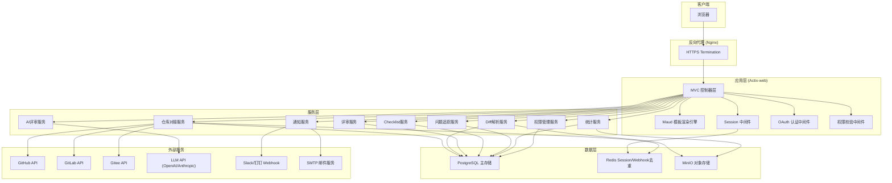
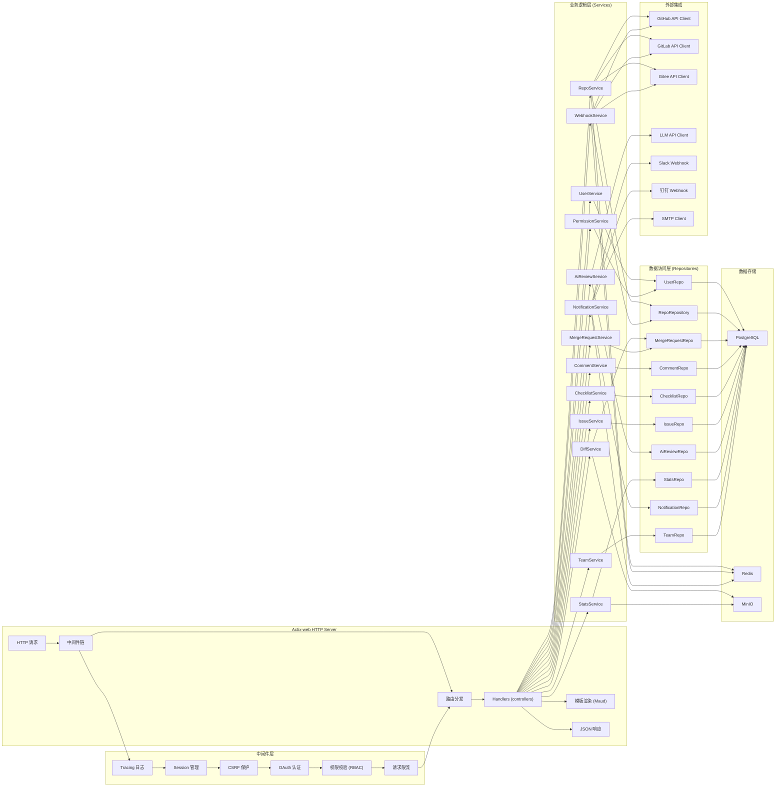
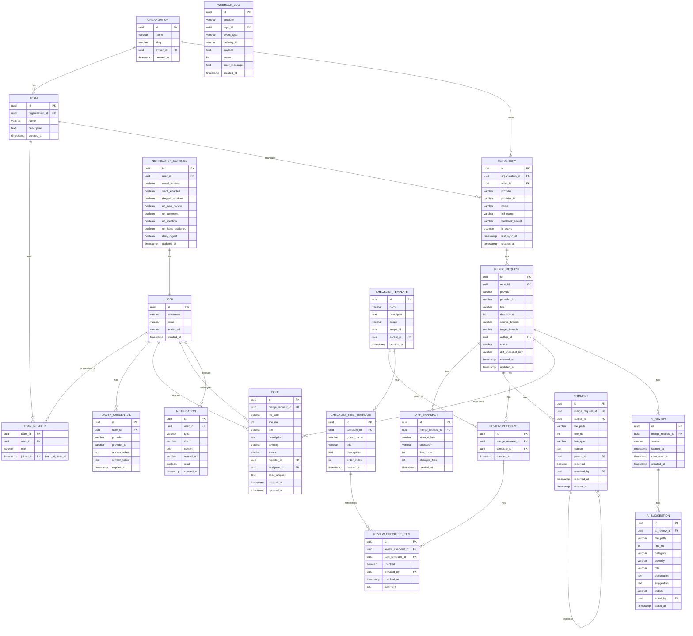

## 1. 架构设计



## 2. 技术描述

- **后端框架**：Actix-web 4.4+ (高性能异步Web框架)
- **模板引擎**：Maud 0.25+ (Rust类型安全的HTML模板引擎)
- **数据库**：PostgreSQL 14+ (主存储) + SQLx 0.7+ (异步ORM)
- **缓存**：Redis 7+ (Session存储、Webhook去重、热点数据缓存) + redis-rs 0.24+
- **对象存储**：MinIO (Diff快照、导出报表存储) + rust-s3 0.34+
- **HTTP客户端**：reqwest 0.11+ (调用Git平台API、LLM API)
- **OAuth认证**：oauth2 4.4+ (GitHub/GitLab/Gitee OAuth2.0)
- **配置管理**：config 0.14+ (环境变量 + 配置文件)
- **日志**：tracing 0.1+ + tracing-subscriber 0.3+ (结构化日志)
- **序列化**：serde 1.0+ + serde_json 1.0+
- **时间处理**：chrono 0.4+
- **密码哈希**：argon2 0.5+ (本地用户密码)
- **JWT**：jsonwebtoken 8.0+ (API Token)
- **错误处理**：thiserror 1.0+ + anyhow 1.0+
- **任务调度**：tokio-cron-scheduler 0.9+ (定时任务、Daily Digest)
- **数据库迁移**：sqlx-cli (内嵌迁移脚本)
- **异步运行时**：tokio 1.0+ (多线程异步运行时)

## 3. 路由定义

| 路由方法 | 路由路径 | 用途 | 权限要求 |
|---------|----------|------|----------|
| GET | `/` | 首页/仪表盘 | 已登录 |
| GET | `/login` | 登录页面 | 公开 |
| GET | `/auth/:provider` | OAuth登录跳转 | 公开 |
| GET | `/auth/:provider/callback` | OAuth回调 | 公开 |
| POST | `/logout` | 登出 | 已登录 |
| GET | `/dashboard` | 仪表盘 | 已登录 |
| GET | `/repos` | 仓库列表 | 已登录 |
| GET | `/repos/:id` | 仓库详情 | 已登录 |
| GET | `/repos/:id/settings` | 仓库设置 | Maintainer+ |
| POST | `/repos/:id/sync` | 手动同步 | Maintainer+ |
| GET | `/repos/:id/webhook` | Webhook配置 | Maintainer+ |
| POST | `/webhook/:provider/:repo_id` | Webhook接收端点 | 公开(签名验证) |
| GET | `/merge-requests` | MR/PR列表 | 已登录 |
| GET | `/merge-requests/:id` | 评审详情页 | 已登录 |
| POST | `/merge-requests/:id/comments` | 添加批注 | Reviewer+ |
| GET | `/merge-requests/:id/diff` | Diff数据API | 已登录 |
| GET | `/checklists` | Checklist模板列表 | Maintainer+ |
| GET | `/checklists/:id` | 模板详情 | Maintainer+ |
| POST | `/checklists` | 创建模板 | Maintainer+ |
| PUT | `/checklists/:id` | 更新模板 | Maintainer+ |
| DELETE | `/checklists/:id` | 删除模板 | Maintainer+ |
| POST | `/reviews/:id/checklist` | 勾选Checklist项 | Reviewer+ |
| GET | `/issues` | 问题列表 | 已登录 |
| GET | `/issues/:id` | 问题详情 | 已登录 |
| POST | `/issues` | 创建问题 | Reviewer+ |
| PUT | `/issues/:id/status` | 变更问题状态 | 相关人 |
| PUT | `/issues/:id/assignee` | 分配责任人 | Reviewer+ |
| GET | `/ai/reviews/:mr_id` | AI评审结果 | 已登录 |
| POST | `/ai/reviews/:mr_id/scan` | 触发AI扫描 | Reviewer+ |
| POST | `/ai/suggestions/:id/action` | 采纳/忽略AI建议 | Reviewer+ |
| GET | `/stats` | 统计看板 | Maintainer+ |
| GET | `/stats/coverage` | 评审覆盖率数据 | Maintainer+ |
| GET | `/stats/heatmap` | 问题密度热力图 | Maintainer+ |
| GET | `/stats/personal` | 个人统计 | 已登录 |
| GET | `/notifications` | 通知列表 | 已登录 |
| PUT | `/notifications/:id/read` | 标记已读 | 本人 |
| GET | `/notifications/settings` | 通知设置 | 已登录 |
| PUT | `/notifications/settings` | 更新通知设置 | 已登录 |
| GET | `/admin/organization` | 组织管理 | Owner |
| GET | `/admin/teams` | 团队列表 | Maintainer+ |
| POST | `/admin/teams` | 创建团队 | Owner |
| GET | `/admin/teams/:id/members` | 团队成员 | Maintainer+ |
| POST | `/admin/teams/:id/members` | 添加成员 | Owner |
| PUT | `/admin/teams/:id/members/:user_id/role` | 分配角色 | Owner |
| DELETE | `/admin/teams/:id/members/:user_id` | 移除成员 | Owner |
| GET | `/api/v1/repos` | REST API: 仓库列表 | API Token |
| GET | `/api/v1/merge-requests` | REST API: MR列表 | API Token |
| GET | `/api/v1/issues` | REST API: 问题列表 | API Token |

## 4. API 定义

```rust
// 通用响应结构
#[derive(Debug, Serialize, Deserialize)]
pub struct ApiResponse<T> {
    pub code: i32,
    pub message: String,
    pub data: Option<T>,
}

#[derive(Debug, Serialize, Deserialize)]
pub struct PaginatedResponse<T> {
    pub items: Vec<T>,
    pub total: i64,
    pub page: i32,
    pub per_page: i32,
}

// 用户相关
#[derive(Debug, Serialize, Deserialize)]
pub struct UserInfo {
    pub id: Uuid,
    pub username: String,
    pub email: String,
    pub avatar_url: Option<String>,
    pub provider: String,
    pub provider_id: String,
    pub role: String,
    pub created_at: DateTime<Utc>,
}

#[derive(Debug, Deserialize)]
pub struct LoginRequest {
    pub provider: String,
}

#[derive(Debug, Serialize)]
pub struct LoginResponse {
    pub auth_url: String,
}

// 仓库相关
#[derive(Debug, Serialize, Deserialize)]
pub struct Repository {
    pub id: Uuid,
    pub name: String,
    pub full_name: String,
    pub provider: String,
    pub provider_id: String,
    pub webhook_url: String,
    pub webhook_secret: String,
    pub is_active: bool,
    pub last_sync_at: Option<DateTime<Utc>>,
    pub created_at: DateTime<Utc>,
}

#[derive(Debug, Deserialize)]
pub struct CreateRepoRequest {
    pub provider: String,
    pub provider_id: String,
    pub name: String,
    pub full_name: String,
}

// MR/PR相关
#[derive(Debug, Serialize, Deserialize)]
pub struct MergeRequest {
    pub id: Uuid,
    pub repo_id: Uuid,
    pub provider: String,
    pub provider_id: String,
    pub title: String,
    pub description: Option<String>,
    pub source_branch: String,
    pub target_branch: String,
    pub author_id: Uuid,
    pub status: String,
    pub diff_url: Option<String>,
    pub diff_snapshot_key: Option<String>,
    pub created_at: DateTime<Utc>,
    pub updated_at: DateTime<Utc>,
}

#[derive(Debug, Deserialize)]
pub struct MergeRequestQuery {
    pub repo_id: Option<Uuid>,
    pub status: Option<String>,
    pub author_id: Option<Uuid>,
    pub reviewer_id: Option<Uuid>,
    pub page: Option<i32>,
    pub per_page: Option<i32>,
}

// Diff相关
#[derive(Debug, Serialize, Deserialize)]
pub struct DiffFile {
    pub old_path: String,
    pub new_path: String,
    pub old_mode: Option<String>,
    pub new_mode: Option<String>,
    pub status: String,
    pub similarity: Option<i32>,
    pub hunks: Vec<DiffHunk>,
}

#[derive(Debug, Serialize, Deserialize)]
pub struct DiffHunk {
    pub old_start: i32,
    pub old_lines: i32,
    pub new_start: i32,
    pub new_lines: i32,
    pub header: String,
    pub lines: Vec<DiffLine>,
}

#[derive(Debug, Serialize, Deserialize)]
pub struct DiffLine {
    pub line_type: String,
    pub content: String,
    pub old_line_no: Option<i32>,
    pub new_line_no: Option<i32>,
}

// 批注相关
#[derive(Debug, Serialize, Deserialize)]
pub struct Comment {
    pub id: Uuid,
    pub merge_request_id: Uuid,
    pub author_id: Uuid,
    pub file_path: Option<String>,
    pub line_no: Option<i32>,
    pub line_type: Option<String>,
    pub content: String,
    pub parent_id: Option<Uuid>,
    pub resolved: bool,
    pub resolved_by: Option<Uuid>,
    pub resolved_at: Option<DateTime<Utc>>,
    pub created_at: DateTime<Utc>,
}

#[derive(Debug, Deserialize)]
pub struct CreateCommentRequest {
    pub file_path: Option<String>,
    pub line_no: Option<i32>,
    pub line_type: Option<String>,
    pub content: String,
    pub parent_id: Option<Uuid>,
}

// Checklist相关
#[derive(Debug, Serialize, Deserialize)]
pub struct ChecklistTemplate {
    pub id: Uuid,
    pub name: String,
    pub description: Option<String>,
    pub scope: String,
    pub scope_id: Option<Uuid>,
    pub parent_id: Option<Uuid>,
    pub items: Vec<ChecklistItemTemplate>,
    pub created_at: DateTime<Utc>,
}

#[derive(Debug, Serialize, Deserialize)]
pub struct ChecklistItemTemplate {
    pub id: Uuid,
    pub group: String,
    pub title: String,
    pub description: Option<String>,
    pub order_index: i32,
}

#[derive(Debug, Serialize, Deserialize)]
pub struct ReviewChecklist {
    pub id: Uuid,
    pub merge_request_id: Uuid,
    pub template_id: Uuid,
    pub items: Vec<ReviewChecklistItem>,
}

#[derive(Debug, Serialize, Deserialize)]
pub struct ReviewChecklistItem {
    pub id: Uuid,
    pub item_template_id: Uuid,
    pub checked: bool,
    pub checked_by: Option<Uuid>,
    pub checked_at: Option<DateTime<Utc>>,
    pub comment: Option<String>,
}

// 问题追踪相关
#[derive(Debug, Serialize, Deserialize)]
pub struct Issue {
    pub id: Uuid,
    pub merge_request_id: Option<Uuid>,
    pub file_path: Option<String>,
    pub line_no: Option<i32>,
    pub title: String,
    pub description: String,
    pub severity: String,
    pub status: String,
    pub reporter_id: Uuid,
    pub assignee_id: Option<Uuid>,
    pub code_snippet: Option<String>,
    pub created_at: DateTime<Utc>,
    pub updated_at: DateTime<Utc>,
}

#[derive(Debug, Deserialize)]
pub struct CreateIssueRequest {
    pub merge_request_id: Option<Uuid>,
    pub file_path: Option<String>,
    pub line_no: Option<i32>,
    pub title: String,
    pub description: String,
    pub severity: String,
    pub assignee_id: Option<Uuid>,
    pub code_snippet: Option<String>,
}

// AI评审相关
#[derive(Debug, Serialize, Deserialize)]
pub struct AiReview {
    pub id: Uuid,
    pub merge_request_id: Uuid,
    pub status: String,
    pub started_at: Option<DateTime<Utc>>,
    pub completed_at: Option<DateTime<Utc>>,
    pub suggestions: Vec<AiSuggestion>,
}

#[derive(Debug, Serialize, Deserialize)]
pub struct AiSuggestion {
    pub id: Uuid,
    pub ai_review_id: Uuid,
    pub file_path: String,
    pub line_no: i32,
    pub category: String,
    pub severity: String,
    pub title: String,
    pub description: String,
    pub suggestion: String,
    pub status: String,
    pub acted_by: Option<Uuid>,
    pub acted_at: Option<DateTime<Utc>>,
}

// 统计相关
#[derive(Debug, Serialize, Deserialize)]
pub struct ReviewStats {
    pub period: String,
    pub total_mrs: i64,
    pub reviewed_mrs: i64,
    pub coverage_rate: f64,
    pub avg_response_time_hours: f64,
    pub total_issues: i64,
    pub issue_density: f64,
}

#[derive(Debug, Serialize, Deserialize)]
pub struct PersonalStats {
    pub user_id: Uuid,
    pub username: String,
    pub reviews_done: i64,
    def found: i64,
    pub issues_fixed: i64,
    pub defect_detection_rate: f64,
    pub fix_rate: f64,
}

#[derive(Debug, Serialize, Deserialize)]
pub struct HeatmapData {
    pub file_path: String,
    pub issue_count: i64,
    pub review_count: i64,
    pub density_score: f64,
}

// 通知相关
#[derive(Debug, Serialize, Deserialize)]
pub struct Notification {
    pub id: Uuid,
    pub user_id: Uuid,
    pub type_: String,
    pub title: String,
    pub content: String,
    pub related_url: Option<String>,
    pub read: bool,
    pub created_at: DateTime<Utc>,
}

#[derive(Debug, Serialize, Deserialize)]
pub struct NotificationSettings {
    pub email_enabled: bool,
    pub slack_enabled: bool,
    pub dingtalk_enabled: bool,
    pub on_new_review: bool,
    pub on_comment: bool,
    pub on_mention: bool,
    pub on_issue_assigned: bool,
    pub daily_digest: bool,
}

// 团队管理相关
#[derive(Debug, Serialize, Deserialize)]
pub struct Organization {
    pub id: Uuid,
    pub name: String,
    pub slug: String,
    pub owner_id: Uuid,
    pub created_at: DateTime<Utc>,
}

#[derive(Debug, Serialize, Deserialize)]
pub struct Team {
    pub id: Uuid,
    pub organization_id: Uuid,
    pub name: String,
    pub description: Option<String>,
    pub created_at: DateTime<Utc>,
}

#[derive(Debug, Serialize, Deserialize)]
pub struct TeamMember {
    pub team_id: Uuid,
    pub user_id: Uuid,
    pub role: String,
    pub joined_at: DateTime<Utc>,
}

#[derive(Debug, Deserialize)]
pub struct CreateTeamRequest {
    pub name: String,
    pub description: Option<String>,
}

#[derive(Debug, Deserialize)]
pub struct AddMemberRequest {
    pub user_id: Uuid,
    pub role: String,
}
```

## 5. 服务端架构图



## 6. 数据模型

### 6.1 ER 图



### 6.2 DDL 语句

```sql
-- 启用UUID扩展
CREATE EXTENSION IF NOT EXISTS "uuid-ossp";

-- 组织表
CREATE TABLE organizations (
    id UUID PRIMARY KEY DEFAULT uuid_generate_v4(),
    name VARCHAR(255) NOT NULL,
    slug VARCHAR(100) NOT NULL UNIQUE,
    owner_id UUID NOT NULL,
    created_at TIMESTAMPTZ NOT NULL DEFAULT NOW()
);

-- 团队表
CREATE TABLE teams (
    id UUID PRIMARY KEY DEFAULT uuid_generate_v4(),
    organization_id UUID NOT NULL REFERENCES organizations(id) ON DELETE CASCADE,
    name VARCHAR(255) NOT NULL,
    description TEXT,
    created_at TIMESTAMPTZ NOT NULL DEFAULT NOW()
);

-- 用户表
CREATE TABLE users (
    id UUID PRIMARY KEY DEFAULT uuid_generate_v4(),
    username VARCHAR(100) NOT NULL UNIQUE,
    email VARCHAR(255) NOT NULL UNIQUE,
    avatar_url VARCHAR(500),
    created_at TIMESTAMPTZ NOT NULL DEFAULT NOW()
);

-- 团队成员表
CREATE TABLE team_members (
    team_id UUID NOT NULL REFERENCES teams(id) ON DELETE CASCADE,
    user_id UUID NOT NULL REFERENCES users(id) ON DELETE CASCADE,
    role VARCHAR(50) NOT NULL CHECK (role IN ('owner', 'maintainer', 'reviewer', 'developer')),
    joined_at TIMESTAMPTZ NOT NULL DEFAULT NOW(),
    PRIMARY KEY (team_id, user_id)
);

-- OAuth凭证表
CREATE TABLE oauth_credentials (
    id UUID PRIMARY KEY DEFAULT uuid_generate_v4(),
    user_id UUID NOT NULL REFERENCES users(id) ON DELETE CASCADE,
    provider VARCHAR(50) NOT NULL CHECK (provider IN ('github', 'gitlab', 'gitee')),
    provider_id VARCHAR(255) NOT NULL,
    access_token TEXT NOT NULL,
    refresh_token TEXT,
    expires_at TIMESTAMPTZ,
    created_at TIMESTAMPTZ NOT NULL DEFAULT NOW(),
    UNIQUE (provider, provider_id)
);

-- 仓库表
CREATE TABLE repositories (
    id UUID PRIMARY KEY DEFAULT uuid_generate_v4(),
    organization_id UUID NOT NULL REFERENCES organizations(id) ON DELETE CASCADE,
    team_id UUID REFERENCES teams(id) ON DELETE SET NULL,
    provider VARCHAR(50) NOT NULL CHECK (provider IN ('github', 'gitlab', 'gitee')),
    provider_id VARCHAR(255) NOT NULL,
    name VARCHAR(255) NOT NULL,
    full_name VARCHAR(500) NOT NULL,
    webhook_secret VARCHAR(100) NOT NULL,
    is_active BOOLEAN NOT NULL DEFAULT TRUE,
    last_sync_at TIMESTAMPTZ,
    created_at TIMESTAMPTZ NOT NULL DEFAULT NOW(),
    UNIQUE (provider, provider_id)
);

-- 合并请求表
CREATE TABLE merge_requests (
    id UUID PRIMARY KEY DEFAULT uuid_generate_v4(),
    repo_id UUID NOT NULL REFERENCES repositories(id) ON DELETE CASCADE,
    provider VARCHAR(50) NOT NULL,
    provider_id VARCHAR(255) NOT NULL,
    title VARCHAR(500) NOT NULL,
    description TEXT,
    source_branch VARCHAR(255) NOT NULL,
    target_branch VARCHAR(255) NOT NULL,
    author_id UUID NOT NULL REFERENCES users(id),
    status VARCHAR(50) NOT NULL CHECK (status IN ('open', 'reviewing', 'approved', 'changes_requested', 'merged', 'closed')),
    diff_snapshot_key VARCHAR(500),
    created_at TIMESTAMPTZ NOT NULL DEFAULT NOW(),
    updated_at TIMESTAMPTZ NOT NULL DEFAULT NOW(),
    UNIQUE (provider, provider_id)
);

-- Diff快照表
CREATE TABLE diff_snapshots (
    id UUID PRIMARY KEY DEFAULT uuid_generate_v4(),
    merge_request_id UUID NOT NULL REFERENCES merge_requests(id) ON DELETE CASCADE,
    storage_key VARCHAR(500) NOT NULL,
    checksum VARCHAR(64) NOT NULL,
    line_count INTEGER NOT NULL DEFAULT 0,
    changed_files INTEGER NOT NULL DEFAULT 0,
    created_at TIMESTAMPTZ NOT NULL DEFAULT NOW()
);

-- 评论/批注表
CREATE TABLE comments (
    id UUID PRIMARY KEY DEFAULT uuid_generate_v4(),
    merge_request_id UUID NOT NULL REFERENCES merge_requests(id) ON DELETE CASCADE,
    author_id UUID NOT NULL REFERENCES users(id),
    file_path VARCHAR(500),
    line_no INTEGER,
    line_type VARCHAR(10) CHECK (line_type IN ('old', 'new', 'context')),
    content TEXT NOT NULL,
    parent_id UUID REFERENCES comments(id) ON DELETE CASCADE,
    resolved BOOLEAN NOT NULL DEFAULT FALSE,
    resolved_by UUID REFERENCES users(id),
    resolved_at TIMESTAMPTZ,
    created_at TIMESTAMPTZ NOT NULL DEFAULT NOW()
);

-- Checklist模板表
CREATE TABLE checklist_templates (
    id UUID PRIMARY KEY DEFAULT uuid_generate_v4(),
    name VARCHAR(255) NOT NULL,
    description TEXT,
    scope VARCHAR(50) NOT NULL CHECK (scope IN ('organization', 'team', 'repository')),
    scope_id UUID,
    parent_id UUID REFERENCES checklist_templates(id) ON DELETE SET NULL,
    created_at TIMESTAMPTZ NOT NULL DEFAULT NOW()
);

-- Checklist项模板表
CREATE TABLE checklist_item_templates (
    id UUID PRIMARY KEY DEFAULT uuid_generate_v4(),
    template_id UUID NOT NULL REFERENCES checklist_templates(id) ON DELETE CASCADE,
    group_name VARCHAR(100) NOT NULL,
    title VARCHAR(500) NOT NULL,
    description TEXT,
    order_index INTEGER NOT NULL DEFAULT 0,
    created_at TIMESTAMPTZ NOT NULL DEFAULT NOW()
);

-- 评审Checklist表
CREATE TABLE review_checklists (
    id UUID PRIMARY KEY DEFAULT uuid_generate_v4(),
    merge_request_id UUID NOT NULL REFERENCES merge_requests(id) ON DELETE CASCADE,
    template_id UUID NOT NULL REFERENCES checklist_templates(id),
    created_at TIMESTAMPTZ NOT NULL DEFAULT NOW()
);

-- 评审Checklist项表
CREATE TABLE review_checklist_items (
    id UUID PRIMARY KEY DEFAULT uuid_generate_v4(),
    review_checklist_id UUID NOT NULL REFERENCES review_checklists(id) ON DELETE CASCADE,
    item_template_id UUID NOT NULL REFERENCES checklist_item_templates(id),
    checked BOOLEAN NOT NULL DEFAULT FALSE,
    checked_by UUID REFERENCES users(id),
    checked_at TIMESTAMPTZ,
    comment TEXT,
    created_at TIMESTAMPTZ NOT NULL DEFAULT NOW()
);

-- 问题追踪表
CREATE TABLE issues (
    id UUID PRIMARY KEY DEFAULT uuid_generate_v4(),
    merge_request_id UUID REFERENCES merge_requests(id) ON DELETE SET NULL,
    file_path VARCHAR(500),
    line_no INTEGER,
    title VARCHAR(500) NOT NULL,
    description TEXT NOT NULL,
    severity VARCHAR(50) NOT NULL CHECK (severity IN ('critical', 'major', 'minor', 'info')),
    status VARCHAR(50) NOT NULL CHECK (status IN ('open', 'in_progress', 'pending_review', 'resolved', 'closed')),
    reporter_id UUID NOT NULL REFERENCES users(id),
    assignee_id UUID REFERENCES users(id),
    code_snippet TEXT,
    created_at TIMESTAMPTZ NOT NULL DEFAULT NOW(),
    updated_at TIMESTAMPTZ NOT NULL DEFAULT NOW()
);

-- AI评审表
CREATE TABLE ai_reviews (
    id UUID PRIMARY KEY DEFAULT uuid_generate_v4(),
    merge_request_id UUID NOT NULL REFERENCES merge_requests(id) ON DELETE CASCADE,
    status VARCHAR(50) NOT NULL CHECK (status IN ('pending', 'running', 'completed', 'failed')),
    started_at TIMESTAMPTZ,
    completed_at TIMESTAMPTZ,
    created_at TIMESTAMPTZ NOT NULL DEFAULT NOW()
);

-- AI建议表
CREATE TABLE ai_suggestions (
    id UUID PRIMARY KEY DEFAULT uuid_generate_v4(),
    ai_review_id UUID NOT NULL REFERENCES ai_reviews(id) ON DELETE CASCADE,
    file_path VARCHAR(500) NOT NULL,
    line_no INTEGER NOT NULL,
    category VARCHAR(100) NOT NULL,
    severity VARCHAR(50) NOT NULL CHECK (severity IN ('critical', 'major', 'minor', 'info')),
    title VARCHAR(500) NOT NULL,
    description TEXT NOT NULL,
    suggestion TEXT NOT NULL,
    status VARCHAR(50) NOT NULL CHECK (status IN ('pending', 'accepted', 'ignored')),
    acted_by UUID REFERENCES users(id),
    acted_at TIMESTAMPTZ,
    created_at TIMESTAMPTZ NOT NULL DEFAULT NOW()
);

-- 通知表
CREATE TABLE notifications (
    id UUID PRIMARY KEY DEFAULT uuid_generate_v4(),
    user_id UUID NOT NULL REFERENCES users(id) ON DELETE CASCADE,
    type VARCHAR(100) NOT NULL,
    title VARCHAR(500) NOT NULL,
    content TEXT NOT NULL,
    related_url VARCHAR(500),
    read BOOLEAN NOT NULL DEFAULT FALSE,
    created_at TIMESTAMPTZ NOT NULL DEFAULT NOW()
);

-- 通知设置表
CREATE TABLE notification_settings (
    id UUID PRIMARY KEY DEFAULT uuid_generate_v4(),
    user_id UUID NOT NULL UNIQUE REFERENCES users(id) ON DELETE CASCADE,
    email_enabled BOOLEAN NOT NULL DEFAULT TRUE,
    slack_enabled BOOLEAN NOT NULL DEFAULT FALSE,
    dingtalk_enabled BOOLEAN NOT NULL DEFAULT FALSE,
    slack_webhook_url VARCHAR(500),
    dingtalk_webhook_url VARCHAR(500),
    on_new_review BOOLEAN NOT NULL DEFAULT TRUE,
    on_comment BOOLEAN NOT NULL DEFAULT TRUE,
    on_mention BOOLEAN NOT NULL DEFAULT TRUE,
    on_issue_assigned BOOLEAN NOT NULL DEFAULT TRUE,
    daily_digest BOOLEAN NOT NULL DEFAULT TRUE,
    updated_at TIMESTAMPTZ NOT NULL DEFAULT NOW()
);

-- Webhook日志表
CREATE TABLE webhook_logs (
    id UUID PRIMARY KEY DEFAULT uuid_generate_v4(),
    provider VARCHAR(50) NOT NULL,
    repo_id UUID REFERENCES repositories(id) ON DELETE SET NULL,
    event_type VARCHAR(100) NOT NULL,
    delivery_id VARCHAR(255),
    payload JSONB NOT NULL,
    status INTEGER NOT NULL,
    error_message TEXT,
    created_at TIMESTAMPTZ NOT NULL DEFAULT NOW()
);

-- 索引
CREATE INDEX idx_merge_requests_repo_id ON merge_requests(repo_id);
CREATE INDEX idx_merge_requests_status ON merge_requests(status);
CREATE INDEX idx_merge_requests_author_id ON merge_requests(author_id);
CREATE INDEX idx_merge_requests_updated_at ON merge_requests(updated_at DESC);
CREATE INDEX idx_comments_merge_request_id ON comments(merge_request_id);
CREATE INDEX idx_comments_file_path ON comments(file_path);
CREATE INDEX idx_comments_parent_id ON comments(parent_id);
CREATE INDEX idx_issues_repo_id ON issues(merge_request_id);
CREATE INDEX idx_issues_status ON issues(status);
CREATE INDEX idx_issues_severity ON issues(severity);
CREATE INDEX idx_issues_assignee_id ON issues(assignee_id);
CREATE INDEX idx_issues_reporter_id ON issues(reporter_id);
CREATE INDEX idx_notifications_user_id ON notifications(user_id);
CREATE INDEX idx_notifications_read ON notifications(read);
CREATE INDEX idx_webhook_logs_delivery_id ON webhook_logs(delivery_id);
CREATE INDEX idx_webhook_logs_created_at ON webhook_logs(created_at DESC);
CREATE INDEX idx_team_members_user_id ON team_members(user_id);
CREATE INDEX idx_team_members_role ON team_members(role);
CREATE INDEX idx_repositories_team_id ON repositories(team_id);
CREATE INDEX idx_repositories_organization_id ON repositories(organization_id);
```
