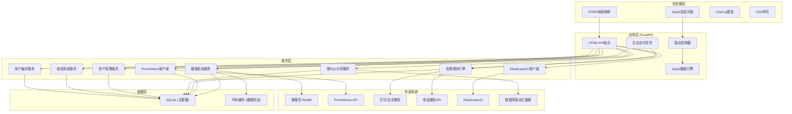
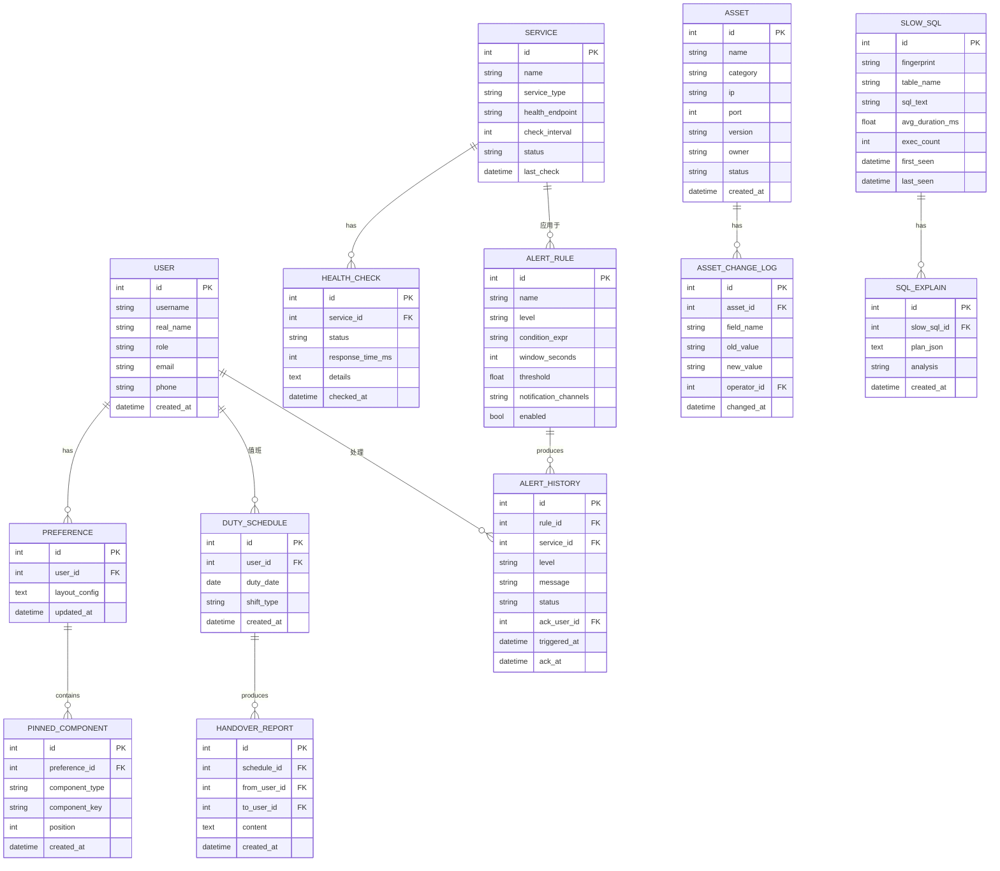
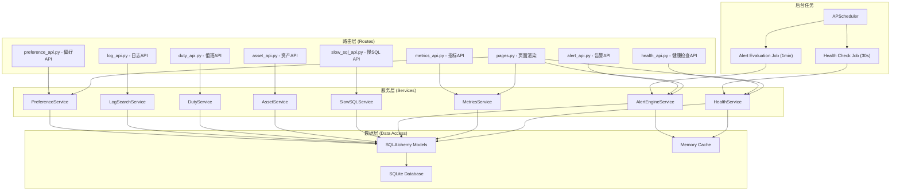

## 1. 架构设计

本项目采用服务端渲染（SSR）架构，FastAPI作为后端框架配合Jinja2模板引擎，HTMX实现局部页面刷新，避免复杂的前端构建流程。整体采用分层架构，保持各模块职责清晰。



## 2. 技术描述

### 2.1 核心技术栈
- **后端框架**: FastAPI @0.109.0 - 高性能异步Web框架
- **模板引擎**: Jinja2 @3.1.3 - 服务端HTML渲染
- **前端交互**: HTMX @1.9.10 - 无JS框架的AJAX局部刷新
- **图表库**: Chart.js @4.4.1 - 时序数据折线图
- **ORM**: SQLAlchemy @2.0.25 - SQLite数据库操作
- **数据库**: SQLite 3.x - 轻量级本地存储
- **异步任务**: APScheduler @3.10.4 - 定时健康检查和告警计算
- **HTTP客户端**: httpx @0.26.0 - 调用Prometheus和外部API
- **图标库**: Lucide Icons - 统一图标风格

### 2.2 项目目录结构
```
DF1-13/
├── app/
│   ├── main.py                    # FastAPI应用入口
│   ├── config.py                  # 配置管理
│   ├── database.py                # 数据库连接
│   ├── models/                    # SQLAlchemy模型
│   │   ├── __init__.py
│   │   ├── user.py                # 用户模型
│   │   ├── service.py             # 服务健康模型
│   │   ├── alert.py               # 告警模型
│   │   ├── slow_sql.py            # 慢SQL模型
│   │   ├── asset.py               # 资产模型
│   │   ├── duty.py                # 值班模型
│   │   └── preference.py          # 用户偏好模型
│   ├── services/                  # 业务逻辑层
│   │   ├── __init__.py
│   │   ├── health_service.py      # 健康检查服务
│   │   ├── metrics_service.py     # 指标查询服务
│   │   ├── alert_service.py       # 告警引擎服务
│   │   ├── slow_sql_service.py    # 慢SQL分析服务
│   │   ├── asset_service.py       # 资产管理服务
│   │   ├── duty_service.py        # 值班服务
│   │   ├── log_service.py         # 日志搜索服务
│   │   └── preference_service.py  # 偏好服务
│   ├── routes/                    # 路由层
│   │   ├── __init__.py
│   │   ├── pages.py               # 页面路由
│   │   ├── health_api.py          # 健康检查API
│   │   ├── metrics_api.py         # 指标API
│   │   ├── alert_api.py           # 告警API
│   │   ├── slow_sql_api.py        # 慢SQL API
│   │   ├── asset_api.py           # 资产API
│   │   ├── duty_api.py            # 值班API
│   │   ├── log_api.py             # 日志API
│   │   └── preference_api.py      # 偏好API
│   ├── schemas/                   # Pydantic模型
│   │   ├── __init__.py
│   │   ├── health.py
│   │   ├── metrics.py
│   │   ├── alert.py
│   │   ├── slow_sql.py
│   │   ├── asset.py
│   │   ├── duty.py
│   │   ├── log.py
│   │   └── preference.py
│   └── templates/                 # Jinja2模板
│       ├── base.html              # 基础布局
│       ├── index.html             # 首页定制视图
│       ├── health.html            # 健康面板
│       ├── metrics.html           # 指标图表
│       ├── alerts.html            # 告警中心
│       ├── slow_sql.html          # 慢SQL分析
│       ├── assets.html            # 资产管理
│       ├── duty.html              # 值班管理
│       ├── logs.html              # 日志搜索
│       ├── settings.html          # 个人设置
│       └── components/            # 可复用组件
│           ├── health_card.html
│           ├── metric_chart.html
│           ├── alert_item.html
│           └── tab_nav.html
├── static/                        # 静态资源
│   ├── css/
│   │   └── main.css               # 主样式
│   └── js/
│       └── chart-init.js          # 图表初始化
├── requirements.txt               # Python依赖
├── init_db.py                     # 数据库初始化脚本
└── run.sh                         # 启动脚本
```

## 3. 路由定义

| 路由 | 方法 | 用途 |
|------|------|------|
| `/` | GET | 首页个人定制视图 |
| `/health` | GET | 服务健康面板页面 |
| `/metrics` | GET | 时序指标页面 |
| `/alerts` | GET | 告警中心页面 |
| `/slow-sql` | GET | 慢SQL分析页面 |
| `/assets` | GET | 资产管理页面 |
| `/duty` | GET | 值班管理页面 |
| `/logs` | GET | 日志搜索页面 |
| `/settings` | GET | 个人设置页面 |
| `/api/health/check` | GET | 触发健康检查 |
| `/api/health/status` | GET | HTMX获取健康状态 |
| `/api/health/service/{id}` | GET | 单个服务详情 |
| `/api/metrics/query` | GET | HTMX获取指标数据 |
| `/api/metrics/reload` | POST | 刷新图表数据 |
| `/api/alerts/rules` | GET/POST | 告警规则列表/创建 |
| `/api/alerts/trigger` | POST | 手动触发告警测试 |
| `/api/alerts/ack/{id}` | POST | 确认告警 |
| `/api/slow-sql/list` | GET | 慢SQL列表 |
| `/api/slow-sql/explain/{id}` | GET | SQL执行计划 |
| `/api/assets/list` | GET | 资产列表 |
| `/api/assets/create` | POST | 创建资产 |
| `/api/assets/change-log/{id}` | GET | 资产变更日志 |
| `/api/duty/schedule` | GET | 排班表 |
| `/api/duty/swap` | POST | 临时换班 |
| `/api/duty/handover` | POST | 生成交接报告 |
| `/api/logs/search` | GET | 日志搜索 |
| `/api/logs/templates` | GET/POST | 查询模板 |
| `/api/preferences/layout` | GET/POST | 获取/保存布局 |
| `/api/preferences/pin` | POST | Pin组件到首页 |

## 4. 数据模型定义



## 5. 服务端架构



## 6. DDL 数据定义语言

```sql
-- 用户表
CREATE TABLE users (
    id INTEGER PRIMARY KEY AUTOINCREMENT,
    username VARCHAR(50) UNIQUE NOT NULL,
    real_name VARCHAR(100) NOT NULL,
    role VARCHAR(20) NOT NULL DEFAULT 'operator',
    email VARCHAR(100),
    phone VARCHAR(20),
    created_at DATETIME DEFAULT CURRENT_TIMESTAMP
);

-- 服务表
CREATE TABLE services (
    id INTEGER PRIMARY KEY AUTOINCREMENT,
    name VARCHAR(100) NOT NULL,
    service_type VARCHAR(50) NOT NULL,
    health_endpoint VARCHAR(255) NOT NULL,
    check_interval INTEGER DEFAULT 30,
    status VARCHAR(20) DEFAULT 'unknown',
    last_check DATETIME,
    created_at DATETIME DEFAULT CURRENT_TIMESTAMP
);

-- 健康检查表
CREATE TABLE health_checks (
    id INTEGER PRIMARY KEY AUTOINCREMENT,
    service_id INTEGER NOT NULL,
    status VARCHAR(20) NOT NULL,
    response_time_ms INTEGER,
    details TEXT,
    checked_at DATETIME DEFAULT CURRENT_TIMESTAMP,
    FOREIGN KEY (service_id) REFERENCES services(id)
);
CREATE INDEX idx_health_service ON health_checks(service_id);
CREATE INDEX idx_health_time ON health_checks(checked_at);

-- 告警规则表
CREATE TABLE alert_rules (
    id INTEGER PRIMARY KEY AUTOINCREMENT,
    name VARCHAR(100) NOT NULL,
    level VARCHAR(10) NOT NULL,
    condition_expr TEXT NOT NULL,
    window_seconds INTEGER DEFAULT 300,
    threshold FLOAT,
    notification_channels TEXT NOT NULL,
    enabled BOOLEAN DEFAULT 1,
    created_at DATETIME DEFAULT CURRENT_TIMESTAMP
);

-- 告警历史表
CREATE TABLE alert_history (
    id INTEGER PRIMARY KEY AUTOINCREMENT,
    rule_id INTEGER,
    service_id INTEGER,
    level VARCHAR(10) NOT NULL,
    message TEXT NOT NULL,
    status VARCHAR(20) DEFAULT 'firing',
    ack_user_id INTEGER,
    triggered_at DATETIME DEFAULT CURRENT_TIMESTAMP,
    ack_at DATETIME,
    FOREIGN KEY (rule_id) REFERENCES alert_rules(id),
    FOREIGN KEY (service_id) REFERENCES services(id),
    FOREIGN KEY (ack_user_id) REFERENCES users(id)
);
CREATE INDEX idx_alert_status ON alert_history(status);
CREATE INDEX idx_alert_time ON alert_history(triggered_at);

-- 慢SQL表
CREATE TABLE slow_sqls (
    id INTEGER PRIMARY KEY AUTOINCREMENT,
    fingerprint VARCHAR(64) UNIQUE NOT NULL,
    table_name VARCHAR(100),
    sql_text TEXT NOT NULL,
    avg_duration_ms FLOAT DEFAULT 0,
    exec_count INTEGER DEFAULT 0,
    first_seen DATETIME DEFAULT CURRENT_TIMESTAMP,
    last_seen DATETIME DEFAULT CURRENT_TIMESTAMP
);
CREATE INDEX idx_slow_sql_table ON slow_sqls(table_name);

-- SQL执行计划表
CREATE TABLE sql_explains (
    id INTEGER PRIMARY KEY AUTOINCREMENT,
    slow_sql_id INTEGER NOT NULL,
    plan_json TEXT,
    analysis TEXT,
    created_at DATETIME DEFAULT CURRENT_TIMESTAMP,
    FOREIGN KEY (slow_sql_id) REFERENCES slow_sqls(id)
);

-- 资产表
CREATE TABLE assets (
    id INTEGER PRIMARY KEY AUTOINCREMENT,
    name VARCHAR(100) NOT NULL,
    category VARCHAR(50) NOT NULL,
    ip VARCHAR(45),
    port INTEGER,
    version VARCHAR(50),
    owner VARCHAR(50),
    status VARCHAR(20) DEFAULT 'normal',
    created_at DATETIME DEFAULT CURRENT_TIMESTAMP
);
CREATE INDEX idx_asset_category ON assets(category);

-- 资产变更日志表
CREATE TABLE asset_change_logs (
    id INTEGER PRIMARY KEY AUTOINCREMENT,
    asset_id INTEGER NOT NULL,
    field_name VARCHAR(50) NOT NULL,
    old_value TEXT,
    new_value TEXT,
    operator_id INTEGER,
    changed_at DATETIME DEFAULT CURRENT_TIMESTAMP,
    FOREIGN KEY (asset_id) REFERENCES assets(id),
    FOREIGN KEY (operator_id) REFERENCES users(id)
);

-- 值班表
CREATE TABLE duty_schedules (
    id INTEGER PRIMARY KEY AUTOINCREMENT,
    user_id INTEGER NOT NULL,
    duty_date DATE NOT NULL,
    shift_type VARCHAR(20) DEFAULT 'day',
    created_at DATETIME DEFAULT CURRENT_TIMESTAMP,
    FOREIGN KEY (user_id) REFERENCES users(id),
    UNIQUE(user_id, duty_date, shift_type)
);
CREATE INDEX idx_duty_date ON duty_schedules(duty_date);

-- 交接报告表
CREATE TABLE handover_reports (
    id INTEGER PRIMARY KEY AUTOINCREMENT,
    schedule_id INTEGER,
    from_user_id INTEGER NOT NULL,
    to_user_id INTEGER NOT NULL,
    content TEXT NOT NULL,
    created_at DATETIME DEFAULT CURRENT_TIMESTAMP,
    FOREIGN KEY (schedule_id) REFERENCES duty_schedules(id),
    FOREIGN KEY (from_user_id) REFERENCES users(id),
    FOREIGN KEY (to_user_id) REFERENCES users(id)
);

-- 用户偏好表
CREATE TABLE preferences (
    id INTEGER PRIMARY KEY AUTOINCREMENT,
    user_id INTEGER UNIQUE NOT NULL,
    layout_config TEXT,
    updated_at DATETIME DEFAULT CURRENT_TIMESTAMP,
    FOREIGN KEY (user_id) REFERENCES users(id)
);

-- 置顶组件表
CREATE TABLE pinned_components (
    id INTEGER PRIMARY KEY AUTOINCREMENT,
    preference_id INTEGER NOT NULL,
    component_type VARCHAR(50) NOT NULL,
    component_key VARCHAR(100) NOT NULL,
    position INTEGER DEFAULT 0,
    created_at DATETIME DEFAULT CURRENT_TIMESTAMP,
    FOREIGN KEY (preference_id) REFERENCES preferences(id)
);

-- 日志查询模板表
CREATE TABLE log_templates (
    id INTEGER PRIMARY KEY AUTOINCREMENT,
    user_id INTEGER NOT NULL,
    name VARCHAR(100) NOT NULL,
    query_config TEXT NOT NULL,
    created_at DATETIME DEFAULT CURRENT_TIMESTAMP,
    FOREIGN KEY (user_id) REFERENCES users(id)
);

-- 初始数据
INSERT INTO users (username, real_name, role, email, phone) VALUES
('admin', '系统管理员', 'admin', 'admin@example.com', '13800138000'),
('operator1', '张三', 'operator', 'zhangsan@example.com', '13800138001'),
('operator2', '李四', 'operator', 'lisi@example.com', '13800138002'),
('viewer1', '王五', 'viewer', 'wangwu@example.com', '13800138003');

INSERT INTO services (name, service_type, health_endpoint, check_interval) VALUES
('订单服务', 'microservice', 'http://order-service:8080/health', 30),
('用户服务', 'microservice', 'http://user-service:8080/health', 30),
('支付服务', 'microservice', 'http://pay-service:8080/health', 30),
('MySQL主库', 'database', 'http://db-proxy:9090/health', 60),
('Redis集群', 'cache', 'http://redis-proxy:9090/health', 60),
('RabbitMQ', 'mq', 'http://mq-proxy:15672/health', 60);

INSERT INTO alert_rules (name, level, condition_expr, window_seconds, threshold, notification_channels, enabled) VALUES
('5分钟错误率超3%且请求量>100', 'P1', 'error_rate > 3 AND qps > 100', 300, 3.0, 'dingtalk,webhook', 1),
('CPU使用率超90%', 'P2', 'cpu_usage > 90', 300, 90.0, 'dingtalk', 1),
('内存使用率超95%', 'P0', 'memory_usage > 95', 60, 95.0, 'phone,dingtalk', 1),
('磁盘使用率超85%', 'P3', 'disk_usage > 85', 3600, 85.0, 'dingtalk', 1),
('慢查询>100ms超过10次/分钟', 'P2', 'slow_sql_count > 10', 60, 10.0, 'dingtalk', 1);

INSERT INTO assets (name, category, ip, port, version, owner, status) VALUES
('web-01', 'server', '192.168.1.10', 22, 'CentOS 7.9', '张三', 'normal'),
('web-02', 'server', '192.168.1.11', 22, 'CentOS 7.9', '张三', 'normal'),
('db-master', 'database', '192.168.1.20', 3306, 'MySQL 8.0', '李四', 'normal'),
('db-slave', 'database', '192.168.1.21', 3306, 'MySQL 8.0', '李四', 'normal'),
('redis-01', 'cache', '192.168.1.30', 6379, 'Redis 7.0', '王五', 'normal'),
('mq-01', 'mq', '192.168.1.40', 5672, 'RabbitMQ 3.12', '王五', 'normal');
```
