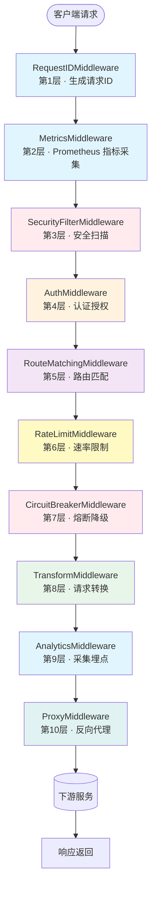
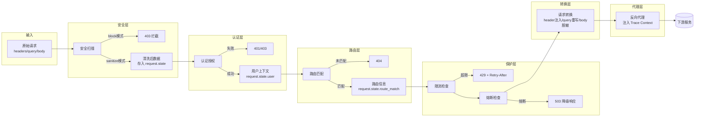
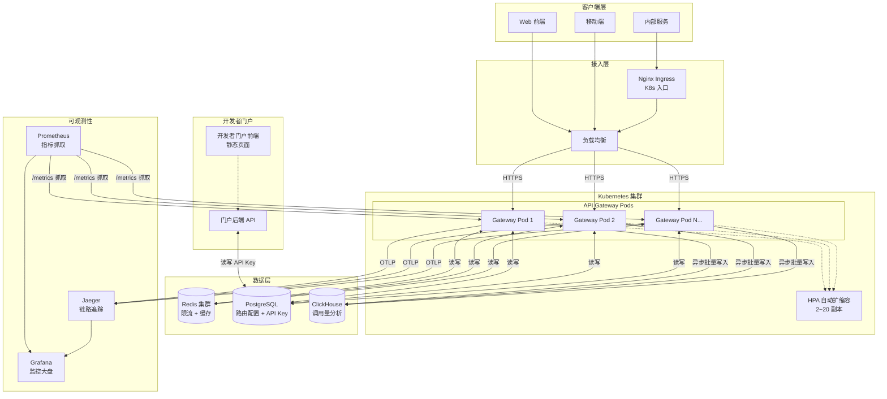
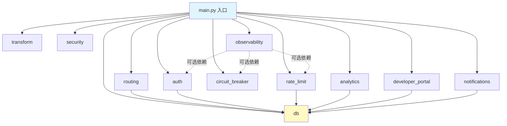

# API Gateway 架构文档

> 本文档描述 API 网关的整体架构、请求生命周期、部署拓扑和代码组织方式。
> 新人上手指南请移步 [快速上手](#快速上手-3-步跑起来)。

---

## 一、请求生命周期

请求从进入网关到返回响应，会依次经过 10 个中间件 + 代理转发。
Starlette 中间件采用 **洋葱模型**（逆序注册，正序执行），执行顺序如下：



### 中间件详细说明

| 序号 | 中间件 | 同步/异步 | 可提前返回 | 主要职责 | 写入 request.state |
|------|--------|-----------|-----------|----------|--------------------|
| 1 | RequestIDMiddleware | 同步 | ❌ | 生成全局唯一请求 ID，注入响应头 | `request_id`, `start_time` |
| 2 | MetricsMiddleware | 同步 | ❌ | Prometheus 指标采集（QPS/延迟/活跃请求数） | - |
| 3 | SecurityFilterMiddleware | 异步 | ✅ 403 | SQL注入/XSS/路径遍历等安全扫描，支持拦截和清洗模式 | `security_scan_result`, `security_sanitized`, `sanitized_headers/query/body` |
| 4 | AuthMiddleware | 异步 | ✅ 401/403 | 多策略认证（JWT/OAuth2/mTLS/API Key）+ 路径级授权 | `user`, `is_authenticated`, `auth_strategy`, `auth_required` |
| 5 | RouteMatchingMiddleware | 同步 | ✅ 404 | 前缀/正则/权重 路由匹配，找到目标后端 | `route_match`, `route` |
| 6 | RateLimitMiddleware | 异步 | ✅ 429 | 令牌桶限流，支持单维度和多维度模式 | `rate_limit_result`, `rate_limited` |
| 7 | CircuitBreakerMiddleware | 同步 | ✅ 503 | 熔断器状态机（Closed→Open→HalfOpen），失败率/延迟阈值触发 | `circuit_state`, `circuit_service_name`, `circuit_broken` |
| 8 | TransformMiddleware | 异步 | ❌ | 请求头注入/Query重写/Body脱敏 + CORS | `modified_headers`, `modified_query`, `modified_body` |
| 9 | AnalyticsMiddleware | 异步（后台批量） | ❌ | 调用量分析采集，异步批量写入 ClickHouse | - |
| 10 | ProxyMiddleware | 异步 | - | 反向代理到下游服务，自动注入 Trace Context | `proxy_latency`, `upstream_response` |

### 数据变换流程



### 异步 vs 同步说明

| 类型 | 中间件 | 说明 |
|------|--------|------|
| **必须同步** | RequestID, Metrics, RouteMatching, CircuitBreaker | 逻辑简单，无 IO，同步执行性能更好 |
| **必须异步** | SecurityFilter, Auth, RateLimit, Transform, Analytics, Proxy | 涉及网络 IO（Redis/DB/HTTP调用），异步不阻塞 |

---

## 二、部署拓扑

### 整体架构



### 各组件依赖关系

| 组件 | 读依赖 | 写依赖 | 说明 |
|------|--------|--------|------|
| API Gateway | Redis, PostgreSQL | Redis, PostgreSQL, ClickHouse | 核心服务，请求路径上读写 Redis/PG，异步写 CH |
| 开发者门户 | PostgreSQL | PostgreSQL | 仅管理 API Key 和用户信息 |
| Prometheus | API Gateway (metrics 端点) | - | 只读拉取指标 |
| Grafana | Prometheus, Jaeger, ClickHouse | - | 只读数据源查询 |

### 健康检查端点

| 端点 | 用途 | 检查内容 | 正常响应 | 失败响应 |
|------|------|----------|----------|----------|
| `GET /live` | K8s 存活探针 | 仅检查进程是否活着 | 200 | - |
| `GET /ready` | K8s 就绪探针 | PostgreSQL + Redis 连通性 | 200 + checks | 503 + 失败项 |
| `GET /health` | 运维健康检查 | 服务基本信息 | 200 | - |
| `GET /metrics` | Prometheus 指标 | Prometheus 格式指标数据 | 200 | - |

---

## 三、代码目录结构

```
DF1-78/
├── src/gateway/              # 网关核心代码
│   ├── main.py               # FastAPI 应用入口、中间件注册
│   ├── config.py             # 配置（环境变量驱动）
│   ├── logger.py             # 结构化日志
│   │
│   ├── routing/              # 路由与反向代理
│   │   ├── middleware.py     # 路由匹配中间件（第5层）
│   │   ├── proxy.py          # HTTP 反向代理（httpx）
│   │   ├── router.py         # 路由管理器（前缀/正则/权重）
│   │   ├── models.py         # 路由数据模型
│   │   └── watcher.py        # 路由表热更新监听
│   │
│   ├── auth/                 # 认证授权
│   │   ├── middleware.py     # 认证中间件（第4层）
│   │   ├── jwt.py            # JWT 验证器
│   │   ├── oauth2.py         # OAuth2 插件体系（多 IdP）
│   │   ├── mtls.py           # mTLS 双向证书验证
│   │   └── api_key.py        # API Key 验证
│   │
│   ├── rate_limit/           # 分布式限流
│   │   ├── middleware.py     # 限流中间件（第6层）
│   │   ├── limiter.py        # 令牌桶核心算法 + Redis Lua
│   │   ├── resolvers.py      # 多维度 Key 解析器
│   │   └── lua_scripts/      # Redis Lua 脚本
│   │
│   ├── circuit_breaker/      # 熔断降级
│   │   ├── middleware.py     # 熔断中间件（第7层）
│   │   ├── breaker.py        # 熔断器状态机
│   │   └── fallback.py       # 降级策略（静态/备用目标）
│   │
│   ├── transform/            # 请求/响应转换管线
│   │   ├── middleware.py     # 转换中间件（第8层）
│   │   ├── pipeline.py       # 转换规则管线
│   │   ├── rules.py          # 规则实现（header/query/body）
│   │   └── cors.py           # CORS 跨域处理
│   │
│   ├── security/             # 安全过滤
│   │   ├── middleware.py     # 安全过滤中间件（第3层）
│   │   ├── filter.py         # 安全过滤器核心
│   │   ├── rules.py          # OWASP Top-10 规则集
│   │   └── remote.py         # 远程规则更新器
│   │
│   ├── analytics/            # 使用量分析采集
│   │   ├── middleware.py     # 分析中间件（第9层）
│   │   ├── collector.py      # 批量采集器
│   │   └── clickhouse.py     # ClickHouse 写入器
│   │
│   ├── observability/        # 可观测性（新增）
│   │   ├── middleware.py     # Metrics 中间件（第2层）
│   │   ├── metrics.py        # Prometheus 指标定义
│   │   └── tracing.py        # OpenTelemetry 集成
│   │
│   ├── developer_portal/     # 开发者门户
│   │   ├── routes.py         # 门户 API 路由
│   │   ├── service.py        # 业务逻辑
│   │   └── static/           # 前端静态页面
│   │
│   ├── notifications/        # 通知模块
│   │   └── webhook.py        # Webhook 通知（HMAC签名+重试）
│   │
│   └── db/                   # 数据访问层
│       ├── database.py       # SQLAlchemy 引擎 & Session
│       ├── redis_client.py   # Redis 客户端
│       ├── models.py         # ORM 数据模型
│       └── repository.py     # Repository 模式数据访问
│
├── tests/                    # 测试（单元 + 集成）
│   ├── conftest.py           # 测试 Fixtures
│   ├── test_*.py             # 各模块单元测试
│   └── integration/          # 集成测试
│
├── helm/api-gateway/         # Helm Chart
│   ├── Chart.yaml
│   ├── values.yaml
│   └── templates/
│
├── migrations/               # 数据库迁移脚本
├── docker/prometheus/        # Prometheus 本地开发配置
├── Dockerfile                # 多阶段构建
├── docker-compose.yml        # 本地开发环境
├── .github/workflows/        # GitHub Actions CI/CD
├── pyproject.toml            # 项目元数据 + lint 配置
└── requirements.txt          # Python 依赖
```

---

## 四、包依赖规则

### 依赖方向图



### 依赖规则

> **严禁反向依赖和循环依赖**

| 规则 | 说明 | 示例 |
|------|------|------|
| 1 | **db 层是最底层**，所有业务包都可以依赖 db | `auth/` 依赖 `db/repository.py` ✅ |
| 2 | **中间件层之间不互相依赖** | `rate_limit/` 不能 import `auth/` 的类 ❌ |
| 3 | 中间件之间通过 `request.state` 传递数据 | Auth 写 `request.state.user`，RateLimit 读 ✅ |
| 4 | `observability/` 可以被所有中间件 import | 各中间件调用 `record_*` 函数上报指标 ✅ |
| 5 | `config.py` 和 `logger.py` 是工具层，谁都可以用 | 所有模块都可以 `from gateway.config import get_settings` ✅ |
| 6 | 业务包不依赖 `main.py` | `auth/` 不能从 `main.py` import 东西 ❌ |
| 7 | `developer_portal/` 属于独立业务模块，不依赖中间件层 | 门户不能 import 限流或熔断的内部实现 ❌ |

### request.state 数据契约

中间件之间通过 `request.state` 传递数据，以下是已定义的字段契约：

| 字段 | 类型 | 写入者 | 读取者 | 说明 |
|------|------|--------|--------|------|
| `request_id` | str | RequestID | 所有中间件 | 全局请求 ID，用于日志追踪 |
| `start_time` | float | RequestID | Metrics, Analytics | 请求开始时间戳（秒） |
| `route_match` | RouteMatch | RouteMatching | RateLimit, CircuitBreaker, Transform, Proxy | 路由匹配结果 |
| `user` | dict | Auth | RateLimit, Transform, Analytics | 用户信息 |
| `is_authenticated` | bool | Auth | 下游中间件 | 是否已认证 |
| `rate_limit_result` | RateLimitResult | RateLimit | Analytics | 限流结果 |
| `rate_limited` | bool | RateLimit | - | 是否触发限流（用于日志） |
| `circuit_state` | str | CircuitBreaker | Analytics, Proxy | 熔断器状态 |
| `circuit_broken` | bool | CircuitBreaker | Proxy | 是否被熔断 |
| `modified_headers` | dict | Transform | Proxy | 转换后的请求头 |
| `modified_query` | str | Transform | Proxy | 转换后的 Query String |
| `modified_body` | bytes | Transform | Proxy | 转换后的请求体 |
| `security_scan_result` | SecurityScanResult | SecurityFilter | - | 安全扫描结果 |
| `security_sanitized` | bool | SecurityFilter | Transform | 是否已被安全清洗 |
| `sanitized_headers` | dict | SecurityFilter | Transform | 安全清洗后的 headers |
| `sanitized_query` | str | SecurityFilter | Transform | 安全清洗后的 query |
| `sanitized_body` | bytes | SecurityFilter | Transform | 安全清洗后的 body |
| `cached_body` | bytes | SecurityFilter | Transform, Analytics | 缓存的原始 body（避免重复读取） |

---

## 五、配置说明

完整配置项说明请参考：[配置参考文档](#)（或直接看 [config.py](src/gateway/config.py) 源码注释）

### 配置加载顺序（优先级从高到低）

1. 环境变量（如 `DB_HOST`, `RATE_LIMIT_ENABLED`）
2. `.env` 文件（开发环境）
3. `config.py` 中的默认值

### 敏感配置

以下配置**必须通过环境变量或 K8s Secret 注入**，禁止写在代码或配置文件中：

| 配置项 | 环境变量 | 说明 |
|--------|----------|------|
| 数据库密码 | `DB_PASSWORD` | PostgreSQL 连接密码 |
| Redis 密码 | `REDIS_PASSWORD` | Redis 连接密码（可空） |
| JWT 签名密钥 | `JWT_SECRET_KEY` | JWT HS256 签名密钥 |
| OAuth2 Client Secret | - | 从数据库加密存储 |
| API Key 加密密钥 | - | 从数据库加密存储 |

### 是否需要重启

| 配置类型 | 修改后是否需要重启 | 说明 |
|----------|-------------------|------|
| 端口、进程数 | ✅ 需要 | 涉及进程级变更 |
| 中间件开关（如安全过滤器开关） | ✅ 需要 | 中间件在启动时注册 |
| 路由规则 | ❌ 不需要 | 热更新，5 秒内生效 |
| IdP 配置 | ❌ 不需要 | 从数据库动态加载 |
| 限流阈值 | ❌ 不需要 | 路由级配置，热更新 |
| 安全规则 | ❌ 不需要 | 远程规则自动更新 |
| 日志级别 | ✅ 需要 | Python logging 初始化后不可动态修改 |

---

## 六、快速上手（3 步跑起来）

### 前置条件

- Python 3.12+
- Docker + Docker Compose（推荐，一键拉起所有依赖）
- 或者本机安装 PostgreSQL 16 + Redis 7

### 第 1 步：克隆代码并安装依赖

```bash
git clone https://github.com/your-org/api-gateway.git
cd api-gateway

# 建议使用虚拟环境
python -m venv .venv
source .venv/bin/activate

pip install -r requirements.txt
```

### 第 2 步：启动依赖服务（PostgreSQL + Redis）

```bash
# 用 docker-compose 一键拉起（推荐）
docker compose up -d postgres redis

# 或者本机启动（自行修改环境变量）
```

### 第 3 步：启动网关

```bash
# 开发模式，代码热重载
python -m uvicorn gateway.main:app --host 0.0.0.0 --port 8080 --reload --loop uvloop

# 或者直接启动
python -m uvicorn gateway.main:app --host 0.0.0.0 --port 8080 --workers 4
```

### 验证

```bash
# 存活检查
curl http://localhost:8080/live
# → {"status":"alive",...}

# 健康检查
curl http://localhost:8080/health
# → {"status":"healthy",...}

# 就绪检查（需要 PG 和 Redis 都通）
curl http://localhost:8080/ready
# → {"status":"ready","checks":{"redis":"ok","postgresql":"ok"},...}

# 指标端点
curl http://localhost:8080/metrics
# → Prometheus 格式指标数据

# API 文档
open http://localhost:8080/docs
```

### 运行测试

```bash
# 运行全部单元测试
pytest tests/ -v

# 带覆盖率
pytest tests/ --cov=src/gateway --cov-report=term-missing
```

---

## 七、扩展开发指引

### 新增一个中间件

1. 在对应模块下创建 `middleware.py`，继承 `BaseHTTPMiddleware`
2. 实现 `async def dispatch(self, request, call_next)` 方法
3. 在 `main.py` 的 `app.add_middleware()` 中按顺序注册
4. 注意：中间件之间通过 `request.state` 传数据，不要直接 import

### 新增一个 IdP 插件

参考 [auth/middleware.py](src/gateway/auth/middleware.py) 模块顶部的「插件扩展点」章节。

### 新增一条限流维度

1. 在 `rate_limit/resolvers.py` 中实现一个新的 Resolver，继承 `RateLimitKeyResolver`
2. 在 `config.py` 的 `RateLimitDimension` 中配置
3. 在 `CompositeKeyResolver._resolvers` 中注册

---

## 八、相关文档

- [API 使用文档](http://localhost:8080/docs)（启动后访问 /docs）
- [Helm Chart 部署说明](helm/api-gateway/README.md)
- [CI/CD 流水线说明](.github/workflows/README.md)
- [开发者门户 API](src/gateway/developer_portal/README.md)
