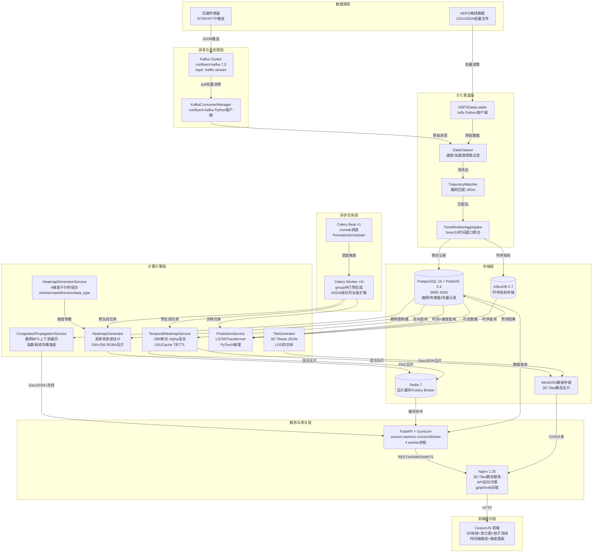

# 城市交通流量三维可视化平台 — 技术交接手册

> 交付对象：交管信息中心运维团队
> 文档版本：v1.0 | 最后更新：2026-06-19

---

## 第一部分：系统架构全景图

### 1.1 组件拓扑与数据流向



### 1.2 端口映射表

| 服务 | 容器内端口 | 宿主机端口 | 协议 | 说明 |
|---|---|---|---|---|
| FastAPI API | 8000 | 8000 | HTTP | RESTful API + Swagger文档 |
| Nginx | 80 | 80 | HTTP | 前端静态 + 反向代理 + 3D Tiles |
| PostgreSQL | 5432 | 5432 | TCP | PostGIS空间数据库 |
| Redis | 6379 | 6379 | TCP | 缓存 + Celery Broker |
| InfluxDB | 8086 | 8086 | HTTP | 时序数据库 + Web Console |
| Kafka | 9092 | 9092 | TCP | 消息队列（外部访问） |
| Kafka Internal | 29092 | — | TCP | Kafka内部通信 |
| Zookeeper | 2181 | 2181 | TCP | Kafka协调服务 |
| MinIO API | 9000 | 9000 | HTTP | S3兼容对象存储 |
| MinIO Console | 9001 | 9001 | HTTP | MinIO管理界面 |
| Metrics | 9090 | — | HTTP | Prometheus指标端点 |

### 1.3 环境变量清单

完整环境变量参见 [.env.example](file:///Users/huangzitong/Desktop/SoloCoder6月/Code/81-85/DF1-83/backend/.env.example)，关键变量分组如下：

**环境控制**
| 变量 | 默认值 | 说明 |
|---|---|---|
| `ENVIRONMENT` | dev | 运行环境：dev/staging/prod，prod自动关闭DEBUG |
| `DEBUG` | true | 调试模式，prod强制false |
| `LOG_LEVEL` | INFO | 日志级别：DEBUG/INFO/WARNING/ERROR |

**PostgreSQL + PostGIS**
| 变量 | 默认值 | 说明 |
|---|---|---|
| `POSTGRES_HOST` | localhost | 数据库主机 |
| `POSTGRES_PORT` | 5432 | 数据库端口 |
| `POSTGRES_USER` | postgres | 数据库用户 |
| `POSTGRES_PASSWORD` | postgres | **生产环境必须修改** |
| `POSTGRES_DB` | traffic_viz | 数据库名 |
| `POSTGRES_POOL_SIZE` | 10 | 连接池大小，生产建议20 |
| `POSTGRES_MAX_OVERFLOW` | 20 | 连接池最大溢出 |
| `POSTGRES_SSL_MODE` | prefer | SSL模式，生产建议require |

**Redis**
| 变量 | 默认值 | 说明 |
|---|---|---|
| `REDIS_HOST` | localhost | Redis主机 |
| `REDIS_PORT` | 6379 | Redis端口 |
| `REDIS_PASSWORD` | 空 | **生产环境必须设置** |
| `REDIS_SSL` | false | 生产建议true |

**Kafka（SASL认证）**
| 变量 | 默认值 | 说明 |
|---|---|---|
| `KAFKA_BOOTSTRAP_SERVERS` | localhost:9092 | Broker地址 |
| `KAFKA_SECURITY_PROTOCOL` | PLAINTEXT | 专有云用SASL_SSL |
| `KAFKA_SASL_MECHANISM` | 空 | 专有云用PLAIN |
| `KAFKA_SASL_USERNAME` | 空 | **走Vault注入** |
| `KAFKA_SASL_PASSWORD` | 空 | **走Vault注入** |

**InfluxDB**
| 变量 | 默认值 | 说明 |
|---|---|---|
| `INFLUXDB_URL` | http://localhost:8086 | InfluxDB地址 |
| `INFLUXDB_TOKEN` | my-token | **走Vault注入** |

**地图差异化参数（不同城市部署需修改）**
| 变量 | 默认值 | 说明 |
|---|---|---|
| `MAP_CENTER_LAT` | 39.9042 | 地图中心纬度（北京） |
| `MAP_CENTER_LON` | 116.4074 | 地图中心经度（北京） |
| `MAP_DEFAULT_ZOOM` | 14 | 默认缩放级别 |
| `TILE_ORIGIN_LON` | 116.0 | 瓦片原点经度 |
| `TILE_ORIGIN_LAT` | 39.5 | 瓦片原点纬度 |
| `CESIUM_TOKEN` | 空 | Cesium Ion访问令牌 |

**Vault密钥管理**
| 变量 | 默认值 | 说明 |
|---|---|---|
| `VAULT_ENABLED` | false | 是否启用Vault |
| `VAULT_ADDR` | 空 | Vault服务地址 |
| `VAULT_TOKEN` | 空 | Vault访问令牌 |
| `VAULT_SECRET_PATH` | secret/data/traffic-viz | 密钥路径 |

**S3对象存储**
| 变量 | 默认值 | 说明 |
|---|---|---|
| `TILES_S3_ENDPOINT` | 空 | MinIO/S3端点URL |
| `TILES_S3_BUCKET` | traffic-tiles | 存储桶名 |
| `TILES_S3_ACCESS_KEY` | 空 | **走Vault注入** |
| `TILES_S3_SECRET_KEY` | 空 | **走Vault注入** |

---

## 第二部分：核心模块代码导读

### 2.1 数据接入管道

#### 2.1.1 Kafka消费者 — [kafka_consumer.py](file:///Users/huangzitong/Desktop/SoloCoder6月/Code/81-85/DF1-83/backend/app/etl/kafka_consumer.py)

**入口函数**：`KafkaConsumerManager.start_consumer(topics)` → `consume_messages(callback, batch_size, timeout)`

**核心逻辑 — offset管理策略**：

```
配置路径: _get_consumer_config()
┌──────────────────────────────────────────────────┐
│ enable.auto.commit = True                         │  ← 自动提交，无需手动commit
│ auto.commit.interval.ms = 5000                    │  ← 每5秒提交一次offset
│ auto.offset.reset = earliest                      │  ← 新消费者从最早消息开始
│ fetch.min.bytes = 1MB                             │  ← 批量拉取最小字节
│ fetch.max.wait.ms = 500                           │  ← 最大等待500ms
└──────────────────────────────────────────────────┘
```

**消费流程**：
1. `start_consumer()` — 创建Consumer实例，订阅topic
2. `consume_messages()` — 循环`poll(timeout=1.0)`，累积到`batch_size=100`条
3. 批量回调callback处理，达到batch_size立即触发
4. poll返回None时（无新消息），flush已有消息
5. `KafkaError._PARTITION_EOF` — 到达分区末尾，仅记日志不中断

**生产者配置**（用于数据回写）：
- `acks=all` — 等待所有ISR副本确认
- `retries=3` — 发送失败重试3次
- `linger.ms=5` — 5ms延迟凑批

**可能的调优参数**：
| 参数 | 当前值 | 调优建议 |
|---|---|---|
| `batch_size` | 100 | 高流量场景可提升至500-1000 |
| `fetch.min.bytes` | 1MB | 降低延迟可减至64KB |
| `auto.commit.interval.ms` | 5000 | 数据准确性要求高可减至1000 |

#### 2.1.2 ETL清洗管道 — [pipeline.py](file:///Users/huangzitong/Desktop/SoloCoder6月/Code/81-85/DF1-83/backend/app/etl/pipeline.py)

**Transform链**：

```
原始消息 → DataCleaner → TrajectoryMatcher → TimeWindowAggregator → 入库
              │                │                    │
              │                │                    └─ 5min/1h窗口均值聚合
              │                └─ Shapely最近邻匹配 ≤50m
              └─ 速度/坐标/拥堵指数校验
```

**DataCleaner核心逻辑**（[pipeline.py#L33-L62](file:///Users/huangzitong/Desktop/SoloCoder6月/Code/81-85/DF1-83/backend/app/etl/pipeline.py#L33-L62)）：
- 必填字段检查：`sensor_id`、`timestamp`、`vehicle_count`，缺一则丢弃
- 负数修正：`vehicle_count < 0` → 强制0
- 速度越界：`avg_speed > 200` 或 `< 0` → 置空NULL
- 拥堵指数裁剪：`congestion_index` 限制在 [0.0, 1.0]
- 坐标合法性：经度 [-180, 180]，纬度 [-90, 90]
- 离群值检测：IQR方法（1.5倍四分位距）或Z-score方法（3σ）

**TrajectoryMatcher路网匹配**（[pipeline.py#L93-L147](file:///Users/huangzitong/Desktop/SoloCoder6月/Code/81-85/DF1-83/backend/app/etl/pipeline.py#L93-L147)）：

几何原理：
1. 传感器坐标构造Shapely `Point(lon, lat)`
2. 遍历路网所有RoadNetwork的LineString几何
3. 调用 `point.distance(line)` 计算欧氏距离（度为单位）
4. 乘以 111000 转换为米（赤道1度≈111km）
5. 取距离 ≤ `max_match_distance=50m` 的最近道路

路网缓存策略：
- `_roads_cache` 缓存1小时（`_cache_duration = timedelta(hours=1)`）
- 避免每次匹配都查数据库

#### 2.1.3 HDFS离线加载 — [hdfs_loader.py](file:///Users/huangzitong/Desktop/SoloCoder6月/Code/81-85/DF1-83/backend/app/etl/hdfs_loader.py)

**入口函数**：`HDFSDataLoader.load_traffic_data(date)`

**数据目录结构**：
```
/traffic/data/
├── traffic/{date}/          ← 按日期分目录
│   ├── data_001.json        ← JSON格式
│   └── data_002.csv         ← 或CSV格式
├── metadata/
│   ├── sensors.json         ← 传感器元数据
│   └── roads.json           ← 路网元数据
└── processed/
    └── cleaned/{date}/      ← 清洗后数据
```

**Celery异步导入**：[tasks.py](file:///Users/huangzitong/Desktop/SoloCoder6月/Code/81-85/DF1-83/backend/app/services/tasks.py#L146-L198) 的 `import_hdfs_data_task` → 调用 `data_cleaner.clean_traffic_data()` → `bulk_save_objects()` 批量入库

---

### 2.2 热力图生成引擎

#### 2.2.1 瓦片投影与生成 — [generator.py](file:///Users/huangzitong/Desktop/SoloCoder6月/Code/81-85/DF1-83/backend/app/heatmap/generator.py)

**入口函数**：`HeatmapGenerator.generate_heatmap_tile(z, x, y, data_points, value_field, max_value)`

**瓦片投影参数**（基于Google/OSM瓦片方案，EPSG:3857）：

投影公式（[geo_utils.py#L7-L20](file:///Users/huangzitong/Desktop/SoloCoder6月/Code/81-85/DF1-83/backend/app/utils/geo_utils.py#L7-L20)）：
```
lon_deg = x / 2^z × 360 - 180           ← 瓦片x → 经度
lat_rad = arctan(sinh(π × (1 - 2y/2^z))) ← 瓦片y → 纬度（墨卡托反投影）
```

**核心流程**：
1. `tile_bbox(z, x, y)` 计算瓦片经纬度范围 `(min_lon, min_lat, max_lon, max_lat)`
2. 过滤在bbox内的数据点
3. 经纬度 → 像素坐标映射：`px = (lon - min_lon) / lon_range × 256`，`py = (1 - (lat - min_lat) / lat_range) × 256`（y轴翻转）
4. 对每个点绘制高斯核：σ = radius/3，`exp(-((x-r)² + (y-r)²) / (2×σ²))`
5. 像素值归一化到 [0, 1]
6. 颜色映射查表

**颜色映射表**（[generator.py#L14-L25](file:///Users/huangzitong/Desktop/SoloCoder6月/Code/81-85/DF1-83/backend/app/heatmap/generator.py#L14-L25)）：

| 归一化值 | RGB | Alpha | 含义 |
|---|---|---|---|
| 0.0 | (0,0,255) | 0 | 无数据（透明蓝） |
| 0.11 | (0,100,255) | 80 | 极低流量 |
| 0.22 | (0,200,255) | 120 | 低流量 |
| 0.33 | (0,255,150) | 160 | 偏低 |
| 0.44 | (0,255,0) | 200 | 正常 |
| 0.55 | (150,255,0) | 200 | 偏高 |
| 0.66 | (255,255,0) | 220 | 较高 |
| 0.77 | (255,150,0) | 230 | 高流量 |
| 0.88 | (255,50,0) | 240 | 拥堵 |
| 1.0 | (255,0,0) | 255 | 严重拥堵 |

`interpolate_color()` 函数对相邻色阶做线性插值。

**关键配置项与调优**：
| 参数 | 当前值 | 位置 | 调优建议 |
|---|---|---|---|
| `tile_size` | 256 | HeatmapGenerator构造 | 不建议修改，Web标准 |
| `radius` | 0.005(度) | HeatmapGenerator构造 | 约550m，缩小时可减至0.002 |
| `pixel_radius` | 动态计算 | 依zoom和radius | 高zoom级需更大像素半径 |
| `max_value` | 自动 | generate_heatmap_tile | 可手动指定防止极值冲散 |

#### 2.2.2 热力图服务层 — [service.py](file:///Users/huangzitong/Desktop/SoloCoder6月/Code/81-85/DF1-83/backend/app/heatmap/service.py)

**入口函数**：`HeatmapService.generate_tile(db, z, x, y, timestamp, data_type, vehicle_type)`

**脏瓦片标记与刷新逻辑**：
1. 每个瓦片的cache_key格式：`heatmap:tile:{z}:{x}:{y}:{timestamp}:{data_type}:{vehicle_type}`
2. 缓存命中直接返回base64解码的PNG
3. 缓存未命中 → 查询PostGIS → 生成瓦片 → 写入Redis（TTL=3600秒）
4. Celery Beat每5分钟触发 `refresh_heatmap_cache` 刷新
5. 时间窗口按zoom自适应：z≥16取5分钟，z≥14取15分钟，z≥12取1小时，z≥10取4小时，其他1天

**多维度查询**（[service.py#L22-L98](file:///Users/huangzitong/Desktop/SoloCoder6月/Code/81-85/DF1-83/backend/app/heatmap/service.py#L22-L98)）：
- JOIN `TrafficFlowRecord` + `TrafficSensor` + `RoadNetwork` 三表
- `vehicle_type` 过滤 `TrafficFlowRecord.vehicle_type`
- `road_level` 过滤 `RoadNetwork.road_type`
- `direction` 过滤 `TrafficFlowRecord.direction`
- 空间过滤：`ST_Intersects(geom, ST_MakeEnvelope(bbox, 4326))`
- 限制最多10000条记录

#### 2.2.3 时态热力图动画 — [temporal.py](file:///Users/huangzitong/Desktop/SoloCoder6月/Code/81-85/DF1-83/backend/app/heatmap/temporal.py)

**入口函数**：`TemporalHeatmapService.get_blended_tile(db, z, x, y, current_dt, ..., alpha)`

**帧索引计算**（[temporal.py#L96-L106](file:///Users/huangzitong/Desktop/SoloCoder6月/Code/81-85/DF1-83/backend/app/heatmap/temporal.py#L96-L106)）：
```
一天 = 24h × 60min / 5min = 288帧
frame_index = total_minutes_from_midnight / 5
```

**Alpha混合过渡**（[temporal.py#L169-L216](file:///Users/huangzitong/Desktop/SoloCoder6月/Code/81-85/DF1-83/backend/app/heatmap/temporal.py#L169-L216)）：
1. 计算当前时间在两个5分钟帧之间的分数 `frac`
2. 获取前帧tile_a和后帧tile_b
3. `blended = (1-α)×A + α×B`（numpy矩阵运算）
4. α≤0.01直接返回前帧，α≥0.99直接返回后帧

**双层缓存架构**：
```
请求 → LRUCache(内存) → Redis(分布式) → 数据库查询+生成 → 写回缓存
         50000条           TTL=7天              JOIN三表+高斯核
```

**LRUCache实现**（[temporal.py#L25-L74](file:///Users/huangzitong/Desktop/SoloCoder6月/Code/81-85/DF1-83/backend/app/heatmap/temporal.py#L25-L74)）：
- `OrderedDict` + `RLock` 线程安全
- 超出`max_size=50000`时淘汰最久未访问项
- TTL过期自动清理（`_evict_expired()`）
- `clear_before(cutoff)` 按时间批量清除7天前帧

#### 2.2.4 多维度服务 — [dimensions.py](file:///Users/huangzitong/Desktop/SoloCoder6月/Code/81-85/DF1-83/backend/app/heatmap/dimensions.py)

**维度编码key格式**：`{data_type}:vt={vehicle_type}:rl={road_level}:d={direction}`

**笛卡尔积组合**：4(data_type) × 6(vehicle_type含all) × 5(road_level含all) × 3(direction含both) = **360种组合**

**API端点**：
- `GET /dimensions/meta` — 所有维度定义含中文label
- `GET /dimensions/available` — 数据库实际存在的维度值
- `GET /dimensions/combos` — 全部360种组合
- `GET /dimensions/popular` — 按权重排序的Top 20常用组合

---

### 2.3 3D Tiles切片服务

#### 2.3.1 瓦片生成 — [generator.py](file:///Users/huangzitong/Desktop/SoloCoder6月/Code/81-85/DF1-83/backend/app/tiles/generator.py)

**入口函数**：`TileGenerator.generate_building_tile(db, z, x, y)` / `generate_road_tile()` / `generate_poi_tile()`

**3D Tileset构造**（[generator.py#L179-L224](file:///Users/huangzitong/Desktop/SoloCoder6月/Code/81-85/DF1-83/backend/app/tiles/generator.py#L179-L224)）：

```json
{
  "asset": {"version": "1.0"},
  "geometricError": 500,
  "root": {
    "transform": [1,0,0,0, 0,1,0,0, 0,0,1,0, MAP_CENTER_LON, MAP_CENTER_LAT, 0, 1],
    "geometricError": 500,
    "refine": "add",
    "content": {"uri": "/api/v1/tiles/buildings/0/0/0.geojson"},
    "children": [ /* 四叉树递归 */ ]
  }
}
```

**LOD距离阈值配置**：
- `geometricError` 逐层减半：`500 / 2^z`
- `refine: "add"` — 叠加模式，子瓦片不替换父瓦片
- SSE (Screen-Space Error) 计算：`geometric_error / (distance × tan(fov/2))`
- Cesium根据SSE阈值自动切换LOD层级
- z=10到z=18，共8级LOD
- 当前`min_zoom=10`，`max_zoom=20`

**瓦片缓存策略**：
- 文件路径：`{TILE_CACHE_DIR}/{layer_type}/{z}/{x}/{y}.geojson`
- 生成后写磁盘，后续请求直接读文件
- `clear_cache(layer_type)` — 删除指定图层的缓存目录
- `get_cache_stats()` — 统计各图层瓦片数量和磁盘占用

**b3dm二进制格式说明**：
当前实现输出GeoJSON格式的3D Tiles（content.uri指向.geojson文件）。若需升级为b3dm二进制格式：
- b3dm = `[28字节header] + [Feature Table JSON] + [Feature Table Binary] + [Batch Table JSON] + [Batch Table Binary] + [glTF body]`
- Header：`magic="b3dm"` + `version=1` + `byteLength` + 各段偏移量
- glTF body包含3D模型的顶点、法线、材质等GPU数据

**关键配置项**：
| 参数 | 当前值 | 位置 | 调优建议 |
|---|---|---|---|
| `min_zoom` | 10 | TileGenerator | 城市级最小层级 |
| `max_zoom` | 20 | TileGenerator | 通常15-18即可 |
| `geometricError` | 500 | generate_3dtileset | 城市级建议200-1000 |
| `refine` | add | generate_3dtileset | 改为"replace"可减少渲染负载 |

#### 2.3.2 WMS/WMTS标准服务 — [wms_service.py](file:///Users/huangzitong/Desktop/SoloCoder6月/Code/81-85/DF1-83/backend/app/tiles/wms_service.py)

**WMS 1.3.0**：
- `GetCapabilities` — 返回XML元数据
- `GetMap` — 按BBOX+尺寸渲染，支持多图层叠加（`Image.alpha_composite`）
- `GetFeatureInfo` — 点击查询

**WMTS 1.0.0**：
- `GoogleMapsCompatible` TileMatrixSet
- `GetTile` — 直接代理到HeatmapService/TileGenerator
- CRS: EPSG:3857（Web墨卡托）

---

### 2.4 拥堵传播分析 — [congestion_propagation.py](file:///Users/huangzitong/Desktop/SoloCoder6月/Code/81-85/DF1-83/backend/app/routing/congestion_propagation.py)

**入口函数**：`CongestionPropagationService.analyze_propagation(db, lon, lat, start_time, end_time, max_depth)`

**路网图构建**（[congestion_propagation.py#L18-L93](file:///Users/huangzitong/Desktop/SoloCoder6月/Code/81-85/DF1-83/backend/app/routing/congestion_propagation.py#L18-L93)）：
- 从RoadNetwork提取LineString端点作为图节点
- `_node_key(lon, lat, precision=6)` — 精度6位小数（约0.1米）去重
- `edges[start_node]` → 下游边列表
- `reverse_edges[end_node]` → 上游边列表（BFS上游遍历用）
- 边长用Haversine公式精确计算

**BFS遍历**（[congestion_propagation.py#L117-L187](file:///Users/huangzitong/Desktop/SoloCoder6月/Code/81-85/DF1-83/backend/app/routing/congestion_propagation.py#L117-L187)）：
- `max_depth=5` — 最多5跳
- `max_edges=50` — 最多50条边
- visited用 `(start_node, end_node)` 元组去重
- 累计距离沿路径叠加

**传播强度公式**：
```
propagation_strength = center_congestion × exp(-0.3 × depth) × (1 + congestion) / 2
```
- 中心拥堵度 × 指数衰减（每跳衰减约26%） × 局部拥堵修正
- 结果裁剪到 [0, 1]

**到达时间计算**：
```
arrival_time_minutes = distance_km / max(avg_speed, 5) × 60
```

**严重度分级**：
| 传播强度 | 严重度 | 颜色 |
|---|---|---|
| ≥0.8 | critical | #ff0000 红 |
| ≥0.6 | severe | #ff6600 橙 |
| ≥0.4 | moderate | #ffcc00 黄 |
| ≥0.2 | light | #66ff66 绿 |
| <0.2 | smooth | #00ccff 蓝 |

**前端粒子流线**：每条streamline包含 `particle_count = max(3, int(strength × 10))` 个粒子，Cesium用`CallbackProperty`做线性插值动画。

---

## 第三部分：运维操作手册

### 3.1 日常巡检检查项

#### 服务健康检查端点

| 服务 | 端点 | 预期响应 | 巡检频率 |
|---|---|---|---|
| API服务 | `GET /health` | `{"status": "healthy"}` | 每30秒 |
| PostgreSQL | `pg_isready -h $POSTGRES_HOST -p 5432` | accepting connections | 每30秒 |
| Redis | `redis-cli -h $REDIS_HOST ping` | PONG | 每30秒 |
| InfluxDB | `GET /health` | `{"status":"pass"}` | 每30秒 |
| Kafka | `kafka-topics --bootstrap-server $KAFKA_BROKERS --list` | topic列表 | 每60秒 |
| Nginx | `GET /health` | ok | 每30秒 |
| Celery Worker | `celery -A celery_worker.celery_app inspect ping` | pong | 每5分钟 |

#### Celery队列堆积监控

```bash
# 查看Celery活跃任务数
celery -A celery_worker.celery_app inspect active

# 查看已注册任务
celery -A celery_worker.celery_app inspect registered

# 查看队列长度（Redis作为Broker时）
redis-cli -h $REDIS_HOST -a $REDIS_PASSWORD LLEN celery
```

**告警阈值**：
| 指标 | 告警线 | 严重告警 | 处理 |
|---|---|---|---|
| 队列长度 | >100 | >500 | 扩容Worker |
| 任务执行时间 | >30min | >60min | 检查是否卡死 |
| Worker内存 | >3Gi | >3.8Gi | 重启Worker |
| 任务失败率 | >5% | >20% | 检查异常日志 |

#### 磁盘使用率告警

| 挂载点 | 告警线 | 严重告警 | 说明 |
|---|---|---|---|
| `/app/data/tiles` | >70% | >85% | 3D Tiles瓦片缓存 |
| `/app/data/cache` | >70% | >85% | 热力图缓存 |
| `/app/models` | >80% | >90% | 预测模型文件 |
| PostgreSQL数据目录 | >70% | >85% | 数据库存储 |
| Redis数据目录 | >70% | >85% | 缓存存储 |

#### 自动化巡检脚本

```bash
#!/bin/bash
# 巡检脚本 — 建议crontab每5分钟执行

# API健康
HTTP_CODE=$(curl -s -o /dev/null -w '%{http_code}' http://localhost:8000/health)
[ "$HTTP_CODE" != "200" ] && echo "ALERT: API health check failed ($HTTP_CODE)"

# Redis连接
redis-cli -h $REDIS_HOST -a $REDIS_PASSWORD ping > /dev/null 2>&1
[ $? -ne 0 ] && echo "ALERT: Redis connection failed"

# PostgreSQL连接
pg_isready -h $POSTGRES_HOST -U $POSTGRES_USER > /dev/null 2>&1
[ $? -ne 0 ] && echo "ALERT: PostgreSQL connection failed"

# Celery队列长度
QUEUE_LEN=$(redis-cli -h $REDIS_HOST -a $REDIS_PASSWORD LLEN celery)
[ "$QUEUE_LEN" -gt 100 ] && echo "WARN: Celery queue length: $QUEUE_LEN"

# 磁盘使用率
for mp in /app/data/tiles /app/data/cache /app/models; do
    USAGE=$(df -h $mp | tail -1 | awk '{print $5}' | tr -d '%')
    [ "$USAGE" -gt 85 ] && echo "CRITICAL: Disk usage at $mp: ${USAGE}%"
done
```

---

### 3.2 常见故障处理

#### 故障1：Kafka Lag飙升

**症状**：消费者组积压消息数持续增长，实时数据延迟

**处理步骤**：

```bash
# 1. 查看消费者组Lag
kafka-consumer-groups --bootstrap-server $KAFKA_BROKERS \
    --describe --group traffic-viz-group

# 2. 检查消费者是否存活
kafka-consumer-groups --bootstrap-server $KAFKA_BROKERS \
    --describe --group traffic-viz-group --state

# 3. 如果消费者掉线，重启消费进程
# Docker环境：
docker-compose restart api

# Kubernetes环境：
kubectl rollout restart deployment/api -n traffic-viz

# 4. 如果Lag过大，临时增加消费者实例
# Kubernetes HPA手动扩容：
kubectl scale deployment/api --replicas=6 -n traffic-viz

# 5. 如果是数据突增，确认是否正常
kafka-run-class kafka.tools.GetOffsetShell \
    --broker-list $KAFKA_BROKERS \
    --topic traffic-stream --time -1
```

**预防措施**：
- 设置Kafka Lag监控告警（>10000条触发）
- 配置`session.timeout.ms=30000`防止误判掉线
- 确认`fetch.min.bytes=1MB`和`fetch.max.wait.ms=500`的批量拉取配置

#### 故障2：切片服务磁盘满

**清理脚本**：

```bash
#!/bin/bash
# 清理过期的瓦片缓存和热力图缓存

TILES_DIR="/app/data/tiles"
CACHE_DIR="/app/data/cache"
DAYS_TO_KEEP=7

# 1. 清理超过7天的3D Tiles缓存
find $TILES_DIR -name "*.geojson" -mtime +$DAYS_TO_KEEP -delete
echo "Cleaned tiles older than $DAYS_TO_KEEP days"

# 2. 清理热力图缓存
find $CACHE_DIR -name "*.png" -mtime +$DAYS_TO_KEEP -delete
echo "Cleaned heatmap cache older than $DAYS_TO_KEEP days"

# 3. 清理Redis中的过期时态帧
# 通过Celery Beat自动执行evict_old_frames_task
# 或手动触发：
celery -A celery_worker.celery_app call heatmap.temporal.evict_old_frames

# 4. 清理过期的预测模型文件
find /app/models -name "*.pth" -mtime +30 -delete
echo "Cleaned model files older than 30 days"

# 5. 报告当前磁盘使用
df -h $TILES_DIR $CACHE_DIR /app/models
```

**紧急扩容**：
```bash
# 如果是K8s环境，扩展PVC
kubectl patch pvc tiles-pvc -p '{"spec":{"resources":{"requests":{"storage":"100Gi"}}}}' -n traffic-viz
```

#### 故障3：InfluxDB Retention Policy调整

```bash
# 1. 查看当前retention policy
influx query 'from(bucket: "traffic-data") |> range(start: -30d)' --org traffic-org

# 2. 通过InfluxDB API调整retention
curl -X POST "http://$INFLUXDB_HOST:8086/api/v2/buckets/$BUCKET_ID" \
    -H "Authorization: Token $INFLUXDB_TOKEN" \
    -H "Content-Type: application/json" \
    -d '{"retentionRules": [{"everySeconds": 2592000, "type": "expire"}]}'
    # 2592000秒 = 30天

# 3. 如果InfluxDB写入失败，检查本地重试队列
# 系统使用InfluxDBClient的write_api，内置重试机制
# 重试队列在内存中，进程重启会丢失

# 4. 手动刷新InfluxDB连接
curl -X POST http://localhost:8000/api/v1/admin/tasks/refresh-connections \
    -H "Authorization: Bearer $TOKEN"
```

---

### 3.3 数据更新流程

#### 每日凌晨离线批处理

**操作步骤**：

```bash
# 1. 确认HDFS数据就绪
# 登录HDFS NameNode WebUI: http://$HDFS_HOST:9870
# 检查 /traffic/data/traffic/{昨日日期}/ 目录是否存在

# 2. 触发HDFS数据导入任务
celery -A celery_worker.celery_app call etl.import_hdfs_data_task \
    -a date=2026-06-18

# 3. 验证导入结果
# 查询数据库记录数
psql -h $POSTGRES_HOST -U $POSTGRES_USER -d traffic_viz -c \
    "SELECT COUNT(*) FROM traffic_flow_records WHERE timestamp >= '2026-06-18' AND timestamp < '2026-06-19';"

# 4. 触发时态热力图预生成（昨日5种维度组合）
celery -A celery_worker.celery_app call heatmap.temporal.schedule_pregeneration

# 5. 触发3D Tiles重新生成（如有路网变更）
celery -A celery_worker.celery_app call tiles.regenerate_tiles_task \
    -a layer_type=all -a min_zoom=10 -a max_zoom=15

# 6. 验证瓦片生成
curl http://localhost:8000/api/v1/tiles/buildings/12/3412/1678.geojson | head -c 200

# 7. 清理过期数据（默认保留90天）
celery -A celery_worker.celery_app call etl.cleanup_old_data_task -a days_to_keep=90
```

**Celery Beat自动调度时刻表**（[celery_worker.py#L32-L58](file:///Users/huangzitong/Desktop/SoloCoder6月/Code/81-85/DF1-83/backend/celery_worker.py#L32-L58)）：

| 任务 | 调度规则 | 说明 |
|---|---|---|
| 批量预测 | */15分钟 | 所有活跃传感器预测15/30/60分钟 |
| 清理旧数据 | 每天02:00 | 删除90天前的流量记录 |
| 刷新热力图缓存 | */5分钟 | 标记脏瓦片 |
| 时态帧预生成 | 每天03:30 | 昨日5种维度组合288帧 |
| 过期帧淘汰 | 每天04:00 | 清除7天前的帧缓存 |
| 热门维度预生成 | 每天04:30 | Top 10维度组合瓦片 |

---

## 第四部分：模型训练补充说明

### 4.1 预测模型数据预处理Pipeline

**代码路径**：[prediction/service.py#L250-L281](file:///Users/huangzitong/Desktop/SoloCoder6月/Code/81-85/DF1-83/backend/app/prediction/service.py#L250-L281)

**预处理步骤**：

```
PostgreSQL查询 → DataFrame → 5min重采样 → 前向填充 → Min-Max归一化
     │              │            │              │              │
     │              │            │              │              └─ (x-min)/(max-min)
     │              │            │              └─ 空值用前值填充
     │              │            └─ resample('5min').mean()
     │              └─ 4列: timestamp, vehicle_count, congestion_index, avg_speed
     └─ sensor_id + 时间范围过滤
```

**归一化公式**：
```
normalized = (data - min) / (max - min)
```
注意：min/max保存在实例变量`_min_val`/`_max_val`中，用于反归一化，但**当前实现不随模型持久化**，存在训练-推理不一致风险。建议改进为使用`sklearn.preprocessing.MinMaxScaler`并随模型保存。

### 4.2 训练入口脚本参数说明

**API方式**：`POST /api/v1/prediction/train`
**Celery任务**：`train_model_task(sensor_id, model_type, epochs)`

**参数说明**：

| 参数 | 类型 | 默认值 | 说明 |
|---|---|---|---|
| `sensor_id` | str | 必填 | 传感器ID，决定训练数据来源 |
| `model_type` | str | "lstm" | 模型类型：`lstm` 或 `transformer` |
| `epochs` | int | 100 | 训练轮数 |
| `start_date` | datetime | 30天前 | 训练数据起始时间 |
| `end_date` | datetime | 当前时间 | 训练数据截止时间 |

**模型超参数**（硬编码在[service.py#L42-L47](file:///Users/huangzitong/Desktop/SoloCoder6月/Code/81-85/DF1-83/backend/app/prediction/service.py#L42-L47)和[model.py](file:///Users/huangzitong/Desktop/SoloCoder6月/Code/81-85/DF1-83/backend/app/prediction/model.py)）：

| 参数 | LSTM | Transformer | 说明 |
|---|---|---|---|
| `input_size` | 1 | 1 | 输入特征维度 |
| `hidden_size` / `d_model` | 64 | 64 | 隐藏层维度 |
| `num_layers` | 2 | 2 | 堆叠层数 |
| `dropout` | 0.2 | 0.1 | Dropout率 |
| `nhead` | — | 4 | 多头注意力头数 |
| `dim_feedforward` | — | 256 | FFN中间层维度 |
| `sequence_length` | 24 | 24 | 输入序列长度（24×5min=2小时） |
| `batch_size` | 32 | 32 | 批量大小 |
| `learning_rate` | 0.001 | 0.001 | Adam学习率 |
| `validation_split` | 0.2 | 0.2 | 验证集比例 |

### 4.3 模型评估指标 Benchmark

**代码路径**：[model.py#L242-L270](file:///Users/huangzitong/Desktop/SoloCoder6月/Code/81-85/DF1-83/backend/app/prediction/model.py#L242-L270)

**评估指标定义**：

| 指标 | 公式 | 说明 |
|---|---|---|
| MSE | `mean((y_true - y_pred)²)` | 均方误差 |
| RMSE | `sqrt(MSE)` | 均方根误差，与原始量纲一致 |
| MAE | `mean(|y_true - y_pred|)` | 平均绝对误差，鲁棒性更好 |
| MAPE | `mean(|(y_true - y_pred) / (y_true + ε)|) × 100%` | 平均绝对百分比误差 |

**典型Benchmark范围**（基于城市交通流量数据，归一化后）：

| 模型 | 15min MAE | 15min RMSE | 30min MAE | 60min RMSE | MAPE |
|---|---|---|---|---|---|
| LSTM | 0.03-0.05 | 0.05-0.08 | 0.04-0.07 | 0.07-0.11 | 8-15% |
| Transformer | 0.03-0.06 | 0.05-0.09 | 0.05-0.08 | 0.08-0.12 | 10-18% |

> 注：以上为归一化后的指标。实际车流量需反归一化，MAE单位为辆/5分钟。

**模型评估调用**：
```python
# 已训练的模型可以直接evaluate
predictor = TrafficPredictor(model_type="lstm")
predictor.load_model("/app/models/sensor001_lstm_20260618120000.pth")
metrics = predictor.evaluate(test_data, sequence_length=24, horizon=1)
# metrics = {"mse": ..., "rmse": ..., "mae": ..., "mape": ...}
```

### 4.4 模型版本管理和A/B切换

**版本命名规则**（[service.py#L57-L59](file:///Users/huangzitong/Desktop/SoloCoder6月/Code/81-85/DF1-83/backend/app/prediction/service.py#L57-L59)）：
```
{sensor_id}_{model_type}_{YYYYMMDDHHMMSS}
例: sensor001_lstm_20260618120000
```

**模型存储**：
- 文件路径：`/app/models/{model_name}.pth`
- 数据库记录：`prediction_models`表，包含`version`、`status`、`metrics`、`config`、`model_path`
- PyTorch保存内容：`model_state_dict` + `model_type` + `input_size` + `output_size`

**查询模型列表**：
```bash
# API方式
curl http://localhost:8000/api/v1/prediction/models?sensor_id=sensor001&model_type=lstm

# 数据库直接查询
psql -c "SELECT name, model_type, version, status, metrics FROM prediction_models ORDER BY trained_at DESC LIMIT 10;"
```

**A/B切换方法**：

1. **指定model_id切换**：
```bash
# 预测时指定使用B版本模型
curl -X POST http://localhost:8000/api/v1/prediction/predict \
    -d '{"sensor_id": "sensor001", "model_id": 42, "horizons": [15, 30, 60]}'
```

2. **自动选择最新模型**：
```bash
# 不指定model_id，系统自动选择该sensor最新训练完成的模型
# 代码逻辑: service.py#L288-L304
# ORDER BY trained_at DESC LIMIT 1
curl -X POST http://localhost:8000/api/v1/prediction/predict \
    -d '{"sensor_id": "sensor001", "model_type": "lstm"}'
```

3. **模型状态管理**：
```sql
-- 标记旧模型为deprecated
UPDATE prediction_models SET status = 'deprecated' WHERE id = 38;

-- 标记新模型为production
UPDATE prediction_models SET status = 'completed' WHERE id = 42;
```

4. **内存缓存清理**：
```python
# 模型缓存在 PredictionService._models_cache 字典中
# 重启Worker即可清空缓存加载新模型
# Kubernetes环境：
kubectl rollout restart deployment/celery-worker -n traffic-viz
```

**模型文件结构**（PyTorch checkpoint）：
```python
{
    'model_state_dict': OrderedDict(...),  # 模型权重
    'model_type': 'lstm',                  # 模型类型标识
    'input_size': 1,                       # 输入维度
    'output_size': 1,                      # 输出维度
}
```

> ⚠️ **重要提醒**：当前模型保存不含归一化参数（min/max），推理时使用实时数据的min/max进行归一化/反归一化，可能导致训练-推理不一致。建议改进方案：将`_min_val`和`_max_val`一并保存到checkpoint中。

---

## 附录A：项目目录结构速查

```
DF1-83/
├── backend/
│   ├── app/
│   │   ├── config.py              ← pydantic-settings 全局配置
│   │   ├── main.py                ← FastAPI入口
│   │   ├── celery_worker.py       ← Celery Beat调度配置
│   │   ├── api/v1/
│   │   │   ├── heatmap.py         ← 热力图+时态+维度 API
│   │   │   ├── analysis.py        ← 拥堵传播分析 API
│   │   │   ├── tiles.py           ← 3D Tiles + WMS/WMTS API
│   │   │   ├── prediction.py      ← 预测 API
│   │   │   ├── data.py            ← 数据接入 API
│   │   │   ├── admin.py           ← 后台管理 API
│   │   │   └── auth.py            ← 认证 API
│   │   ├── heatmap/
│   │   │   ├── generator.py       ← 高斯核密度 + 颜色映射
│   │   │   ├── service.py         ← 热力图服务 + 缓存
│   │   │   ├── temporal.py        ← 时态动画 + LRU + Alpha混合
│   │   │   └── dimensions.py      ← 多维度定义 + 组合
│   │   ├── tiles/
│   │   │   ├── generator.py       ← 3D Tileset + LOD四叉树
│   │   │   └── wms_service.py     ← WMS/WMTS标准服务
│   │   ├── etl/
│   │   │   ├── kafka_consumer.py  ← Kafka消费 + 生产
│   │   │   ├── pipeline.py        ← 清洗 + 路网匹配 + 聚合
│   │   │   └── hdfs_loader.py     ← HDFS读写
│   │   ├── prediction/
│   │   │   ├── model.py           ← LSTM/Transformer PyTorch模型
│   │   │   └── service.py         ← 训练 + 预测 + 评估
│   │   ├── routing/
│   │   │   ├── congestion_propagation.py  ← 路网图 + BFS + 传播
│   │   │   └── service.py         ← OD分析 + 路径分析
│   │   ├── models/__init__.py     ← SQLAlchemy数据模型
│   │   ├── services/tasks.py      ← Celery任务定义
│   │   └── utils/
│   │       ├── geo_utils.py       ← 瓦片投影 + Haversine
│   │       ├── redis_client.py    ← Redis单例连接
│   │       └── influxdb_client.py ← InfluxDB读写
│   ├── tests/                     ← pytest测试套件
│   ├── Dockerfile                 ← 多阶段构建(5 target)
│   └── requirements.txt           ← Python依赖
├── frontend/
│   ├── js/app.js                  ← CesiumJS 3D前端
│   ├── css/style.css              ← 玻璃态UI样式
│   └── index.html                 ← 主页面
├── k8s/                           ← Kubernetes清单
├── docker-compose.yml             ← 本地开发编排
├── .gitlab-ci.yml                 ← CI/CD流水线
└── 技术交接手册.md                ← 本文档
```

## 附录B：Python技术栈速查（面向Java/GIS团队）

| Python概念 | Java等价 | 说明 |
|---|---|---|
| `pip` | Maven/Gradle | 包管理器，依赖在requirements.txt |
| `venv` | 不需要 | Python虚拟环境，隔离依赖 |
| `pydantic` | Jackson + Bean Validation | 数据校验+序列化，配置用pydantic-settings |
| `FastAPI` | Spring Boot | 异步Web框架，自带Swagger文档(/docs) |
| `SQLAlchemy` | JPA/Hibernate | ORM，GeoAlchemy2对应PostGIS |
| `Celery` | Quartz + 线程池 | 分布式任务队列，Broker用Redis |
| `PyTorch` | DL4J | 深度学习框架，模型存为.pth文件 |
| `Shapely` | JTS Topology Suite | 2D几何操作库 |
| `GeoAlchemy2` | Hibernate Spatial | PostGIS的Python ORM扩展 |
| `numpy` | 不直接等价 | 高性能数值计算，类似MATLAB |
| `confluent-kafka` | kafka-clients | Kafka Java客户端的Python封装 |
